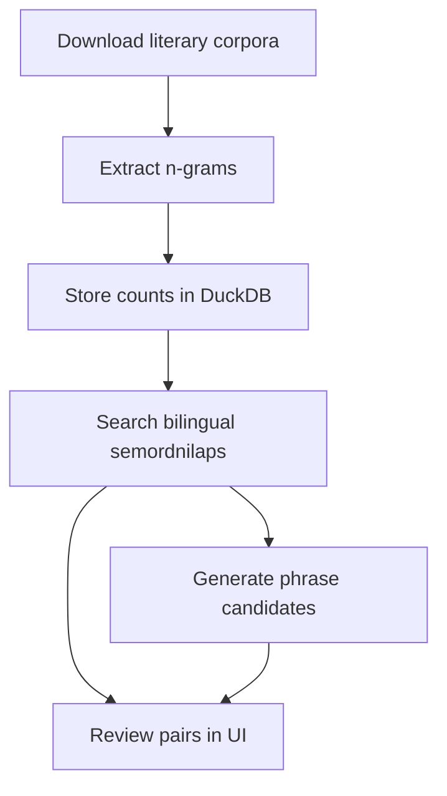

<h1 align="center">Semordnilap</h1>

<p align="center">
  <strong>roma &lt;&gt; amor</strong>
</p>

<p align="center">
  Tools for discovering bilingual semordnilaps from literary corpora.
</p>

## Overview

`semordnilap` is an experimental toolkit for finding word and phrase pairs
whose normalized forms reverse across two languages.

For example:

```text
ES: roma
PT: amor

normalize("roma") == reverse(normalize("amor"))
```

The project focuses on bilingual discovery: extracting corpus n-grams,
searching formal reverse matches across languages, composing longer phrase
candidates from smaller reversible pieces, and reviewing the results manually.

The current pipeline is designed around Spanish and Portuguese, but the
architecture keeps corpus extraction, n-gram storage, search, phrase generation,
and review as separate tools.

## Workflow



## Installation

This project uses [`uv`](https://docs.astral.sh/uv/).

```bash
uv sync
```

Run commands through `uv run`:

```bash
uv run sp_ngrams --help
```

## Tools

### 1. Corpus

Download cleaned Wikisource corpora from Hugging Face.

```bash
uv run sp_corpus_wikisource \
  --langs es pt \
  --date 20231201 \
  --out-dir data/corpus/wikisource
```

This writes one JSONL file per language. Each file can then be passed to the
n-gram extractor.

### 2. N-Grams

Extract unigrams, bigrams, and trigrams from a corpus, store counts in DuckDB,
and compact totals. Extraction and TSV export are separate steps.

```bash
uv run sp_ngrams extract \
  --input data/corpus/wikisource/wikisource_es_20231201.jsonl \
  --lang es \
  --corpus wikisource_20231201 \
  --db-path data/ngrams/counts.duckdb \
  --format jsonl
```

Repeat for the target language:

```bash
uv run sp_ngrams extract \
  --input data/corpus/wikisource/wikisource_pt_20231201.jsonl \
  --lang pt \
  --corpus wikisource_20231201 \
  --db-path data/ngrams/counts.duckdb \
  --format jsonl
```

Export a TSV view only when you need one for inspection or downstream tools:

```bash
uv run sp_ngrams export \
  --lang es \
  --corpus wikisource_20231201 \
  --db-path data/ngrams/counts.duckdb \
  --out data/ngrams/es.tsv \
  --min-count 5 \
  --max-results 100000
```

The extractor keeps raw partial counts and compacted totals. The normal flow
compacts progressively after extraction.

You can inspect storage statistics with:

```bash
uv run sp_ngrams db stats \
  --db-path data/ngrams/counts.duckdb \
  --lang es \
  --corpus wikisource_20231201
```

You can also maintain the database directly:

```bash
uv run sp_ngrams db delete \
  --db-path data/ngrams/counts.duckdb \
  --lang en \
  --corpus wikisource_20231201
```

```bash
uv run sp_ngrams db compact \
  --db-path data/ngrams/counts.duckdb \
  --lang es \
  --corpus wikisource_20231201
```

### 3. Search

Search semordnilap pairs across two languages using the n-gram database.

```bash
uv run sp_search_ngrams \
  --db-path data/ngrams/counts.duckdb \
  --out data/search/es_pt.tsv \
  --src-lang es \
  --tgt-lang pt \
  --src-corpus wikisource_20231201 \
  --tgt-corpus wikisource_20231201 \
  --counts-source auto \
  --min-src-count 5 \
  --min-tgt-count 5 \
  --min-norm-len 4 \
  --max-norm-len 18 \
  --max-results 100000
```

The search step enforces the formal rule:

```text
source_norm_key == reverse(target_norm_key)
```

The output TSV is the main input for phrase generation and review.

### 4. Phrases

Generate longer phrase candidates from reversible pair pieces.

If a candidate uses pieces `[A, B, C]`, the source phrase is built as:

```text
A.source B.source C.source
```

and the target phrase is built in reverse:

```text
C.target B.target A.target
```

Run the phrase generator:

```bash
uv run sp_phrases \
  --input data/search/es_pt.tsv \
  --out data/search/es_pt.phrases.tsv \
  --min-source-count 5 \
  --min-target-count 5 \
  --piece-limit 1000 \
  --beam-size 500 \
  --min-pieces 2 \
  --max-pieces 3 \
  --max-results 1000
```

The phrase scorer combines pair quality, corpus frequency, simple lexical
signals, and penalties for fragile fragments or repeated/reversible pieces.

Optionally, you can add external language-model plausibility with KenLM:

```bash
uv run sp_phrases \
  --input data/search/es_pt.tsv \
  --out data/search/es_pt.phrases.lm.tsv \
  --source-lm data/lm/es.bin \
  --target-lm data/lm/pt.bin \
  --plausibility-weight 1.0
```

Without language models, the plausibility signal is disabled.

### 5. Review

Open an interactive Gradio UI for inspecting search or phrase outputs.

```bash
uv run sp_review \
  --input data/search/es_pt.tsv
```

Or review generated phrase candidates:

```bash
uv run sp_review \
  --input data/search/es_pt.phrases.tsv
```

The interface also lets you select a TSV file manually.

## Typical End-to-End Run

```bash
# 1. Download corpora
uv run sp_corpus_wikisource \
  --langs es pt \
  --out-dir data/corpus/wikisource

# 2. Extract source n-grams
uv run sp_ngrams extract \
  --input data/corpus/wikisource/wikisource_es_20231201.jsonl \
  --lang es \
  --corpus wikisource_20231201 \
  --db-path data/ngrams/counts.duckdb \
  --format jsonl

# 3. Extract target n-grams
uv run sp_ngrams extract \
  --input data/corpus/wikisource/wikisource_pt_20231201.jsonl \
  --lang pt \
  --corpus wikisource_20231201 \
  --db-path data/ngrams/counts.duckdb \
  --format jsonl

# 4. Search bilingual semordnilaps
uv run sp_search_ngrams \
  --db-path data/ngrams/counts.duckdb \
  --out data/search/es_pt.tsv \
  --src-lang es \
  --tgt-lang pt \
  --src-corpus wikisource_20231201 \
  --tgt-corpus wikisource_20231201 \
  --counts-source auto \
  --min-src-count 5 \
  --min-tgt-count 5

# 5. Generate phrase candidates
uv run sp_phrases \
  --input data/search/es_pt.tsv \
  --out data/search/es_pt.phrases.tsv \
  --min-source-count 5 \
  --min-target-count 5 \
  --min-pieces 2 \
  --max-pieces 3

# 6. Review
uv run sp_review \
  --input data/search/es_pt.phrases.tsv
```

## Notes

- The formal reverse condition is deterministic and exact.
- Naturalness is approximate and improved gradually through scoring,
  frequency filters, phrase penalties, optional language models, and human
  review.
- Large corpora can produce many candidates. Start with conservative count
  thresholds and increase the search space once the pipeline is working.
