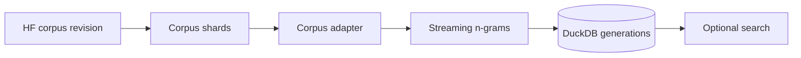

# Semordnilap

Pipeline reproducible para construir n-gramas textuales en español y gallego
directamente desde corpus fuente.


```mermaid
flowchart LR
    H[HF corpus revision] --> C[Corpus shards]
    C --> R[Corpus adapter]
    R --> N[Streaming n-grams]
    N --> D[(DuckDB generations)]
    D --> S[Optional search]
```

## Superficie soportada

```text
sp_corpus              descarga corpus versionados por subcomando
sp_tag                 utilidad independiente de tagging contextual
sp_ngrams              extracción, migración, inspección y exportación
sp_search_ngrams       consumidor opcional de semordnilaps
```

Instalación y comprobación:

```bash
uv sync
uv run pytest -q
uv run ruff check .
```

El flujo completo, desde la descarga hasta la extracción, está en la
[guía del pipeline](docs/guides/pipeline.md). La
[arquitectura técnica](docs/technical/README.md) describe identidades,
manifiestos, recuperación y almacenamiento.

Las decisiones principales son:

- Wikisource y CorpusNÓS se pueden extraer directamente sin generar un corpus
  etiquetado intermedio;
- la puntuación se conserva por defecto y las ventanas pueden cruzar frases,
  pero nunca documentos;
- el almacenamiento de n-gramas es exclusivamente textual y conserva
  `has_punctuation`; no persiste UPOS ni estado de cruce de frase;
- `sp_tag` conserva su propio formato UD JSONL, pero su salida no es una
  entrada de `sp_ngrams`;
- cada artefacto final tiene manifiesto, checksums e identidad inmutable;
- reintentar extracción no duplica recuentos y cambiar una política crea otra
  identidad;
- la extracción conserva por defecto los n-gramas de stopwords y la
  puntuación; los descartes son opciones explícitas `--filter-*`;
- `ñ` se normaliza a `n` por defecto; `--preserve-nasal-letters` conserva la
  distinción cuando se necesita.

Documentación: [mapa](docs/README.md), [ADRs](docs/adr/README.md),
[RFC implementado](docs/rfc/0001-core-pipeline-hardening.md) y
[documento técnico de extracción](docs/technical/ngram-extraction.md).
