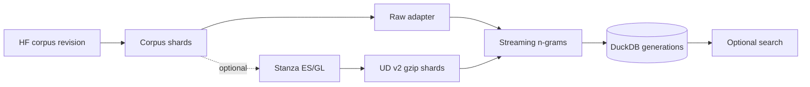

# Semordnilap

Pipeline reproducible para construir n-gramas en español y gallego,
directamente desde corpus fuente o con información contextual UPOS opcional.


```mermaid
flowchart LR
    H[HF corpus revision] --> C[Corpus shards]
    C --> R[Raw adapter]
    C -. optional .-> T[Stanza ES/GL]
    T --> U[UD v2 gzip shards]
    R --> N[Streaming n-grams]
    U --> N
    N --> D[(DuckDB generations)]
    D --> S[Optional search]
```

## Superficie soportada

```text
sp_corpus              descarga corpus versionados por subcomando
sp_tag                 descarga modelos, smoke tests y tagging contextual
sp_ngrams              extracción, migración, inspección y exportación
sp_search_ngrams       consumidor opcional de semordnilaps
```

Instalación y comprobación:

```bash
uv sync
uv run pytest -q
uv run ruff check .
```

El flujo completo, desde la descarga hasta la extracción, está en la
[guía del pipeline](docs/guides/pipeline.md). La
[arquitectura técnica](docs/technical/README.md) describe identidades,
manifiestos, recuperación y almacenamiento.

Las decisiones principales son:

- Wikisource y CorpusNÓS se pueden extraer directamente sin generar un corpus
  etiquetado intermedio;
- la puntuación se conserva por defecto y las ventanas pueden cruzar frases,
  pero nunca documentos;
- el tagging se realiza sobre el contexto completo o sobre fragmentos largos
  con límites explícitos y offsets globales;
- el formato actual es UD JSONL v2 comprimido y dividido en shards; el lector
  mantiene compatibilidad con v1;
- cada artefacto final tiene manifiesto, checksums e identidad inmutable;
- reintentar extracción no duplica recuentos y cambiar una política crea otra
  identidad;
- `ñ` sólo se pliega a `n` cuando se solicita expresamente.

Documentación: [mapa](docs/README.md), [ADRs](docs/adr/README.md),
[RFC implementado](docs/rfc/0001-core-pipeline-hardening.md) y
[plan actual](docs/plan/0003-direct-corpus-ngram-adapters.md).
