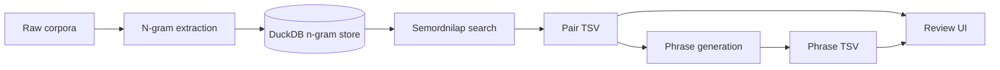

# Guides

This folder contains the operational guides for the main semordnilap pipeline.

## Guides

- [N-grams](ngrams.md): extract, store, compact, export, and maintain corpus n-gram counts.
- [Search](search.md): find bilingual reversible pairs from stored n-gram counts.
- [Phrases](phrases.md): compose longer reversible phrase candidates from pair TSV files.
- [Review](review.md): inspect search or phrase outputs with the Gradio review UI.

## Recommended Order

1. Build or update the n-gram database with `sp_ngrams extract`.
2. Compact counts with `sp_ngrams db compact` if extraction did not compact automatically.
3. Search cross-language pairs with `sp_search_ngrams`.
4. Generate phrase candidates with `sp_phrases generate`.
5. Review pair or phrase TSV files with `sp_review`.

