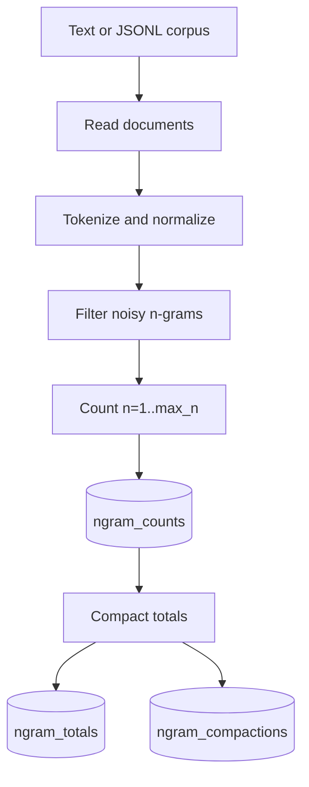
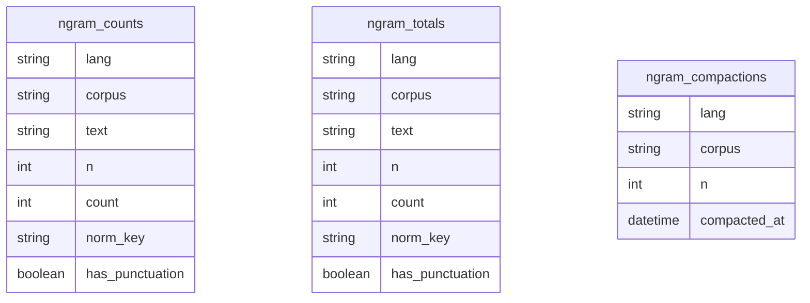

# N-grams Guide

`sp_ngrams` extracts normalized n-gram counts from text corpora and stores them
in DuckDB. These counts are the source material for bilingual semordnilap
search.



## Extract Counts

Text corpus:

```bash
uv run sp_ngrams extract \
  --input data/corpus/es.txt \
  --lang es \
  --corpus wiki \
  --max-n 3 \
  --db-path data/ngrams/counts.duckdb
```

JSONL corpus:

```bash
uv run sp_ngrams extract \
  --input data/corpus/pt.jsonl \
  --format jsonl \
  --text-field text \
  --lang pt \
  --corpus wiki \
  --max-n 3 \
  --db-path data/ngrams/counts.duckdb
```

Useful smoke-test flags:

```bash
uv run sp_ngrams extract \
  --input data/corpus/es.txt \
  --lang es \
  --corpus smoke \
  --limit-docs 100 \
  --db-path data/ngrams/counts.duckdb
```

## Filtering

Extraction applies token and normalized-key filters before counting:

- `--min-token-len` and `--max-token-len` constrain token length.
- `--min-norm-len` removes very short normalized forms.
- `--include-all-stopword-ngrams` keeps n-grams made only of stopwords.
- `--fold-nasal-letters` normalizes `ñ` to `n`; `ç` is always normalized to `c`.
- `--keep-punctuation` (also `--no-omit-punctuation`) allows n-grams to
  cross punctuation. Punctuation remains in `text`, does not count toward
  `n`, and is removed from `norm_key`. By default every punctuation character
  is an n-gram boundary (`--omit-punctuation`).

Known language codes get language-specific filters. Unknown codes fall back to
generic rules.

## Storage Model



`ngram_counts` stores raw partial flushes. `ngram_totals` stores compacted
counts grouped by language, corpus, text, n, normalized key, and punctuation
indicator. Search and export can use either raw or compacted counts, but
compacted totals are usually faster and easier to reason about.

## Compact Counts

Extraction compacts by default. If you used `--no-compact-after-count`, or want
to rebuild totals:

```bash
uv run sp_ngrams db compact \
  --db-path data/ngrams/counts.duckdb \
  --lang es \
  --corpus wiki \
  --max-n 3
```

Compact only one n-gram size:

```bash
uv run sp_ngrams db compact \
  --db-path data/ngrams/counts.duckdb \
  --lang es \
  --corpus wiki \
  --compact-n 2
```

## Inspect and Maintain

Show storage statistics:

```bash
uv run sp_ngrams db stats \
  --db-path data/ngrams/counts.duckdb \
  --lang es \
  --corpus wiki \
  --verbose
```

Delete one language/corpus slice:

```bash
uv run sp_ngrams db delete \
  --db-path data/ngrams/counts.duckdb \
  --lang es \
  --corpus wiki
```

## Export Counts

Export n-grams for inspection:

```bash
uv run sp_ngrams export \
  --db-path data/ngrams/counts.duckdb \
  --lang es \
  --corpus wiki \
  --out data/ngrams/es.tsv \
  --min-count 5 \
  --export-source auto
```

`--export-source auto` uses compacted totals when available and raw counts
otherwise. Use `compact` when you want to fail if totals are missing.
