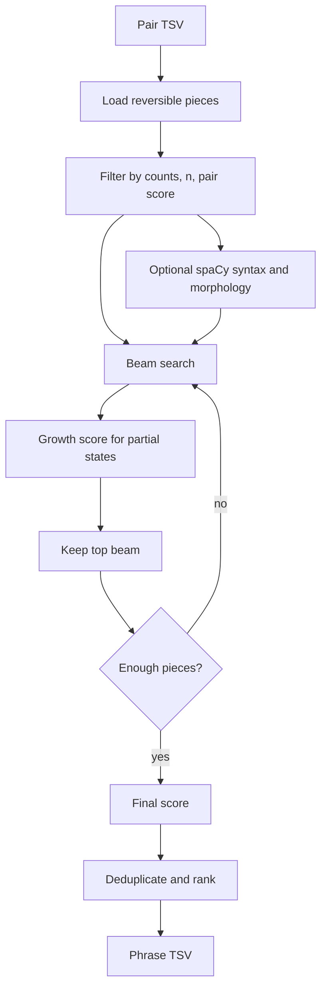
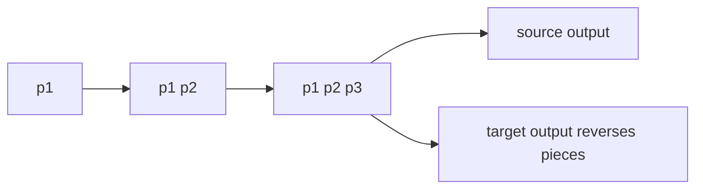
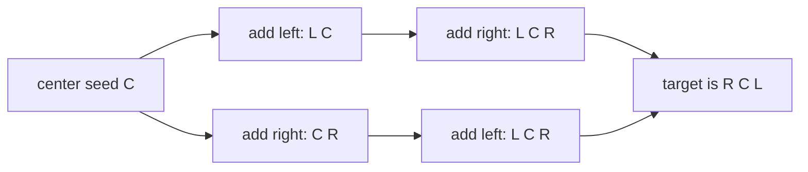
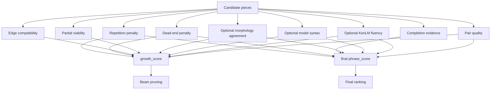

# Phrases Guide

`sp_phrases generate` composes longer bilingual reversible phrase candidates
from a pair TSV generated by `sp_search_ngrams`.

It does not search raw text. Each input row is already a reversible piece:

```text
source_text -> target_text
source_norm_key reversed == target_norm_key
```

The phrase generator builds a sequence of pieces:

```text
source phrase: p1.source p2.source p3.source
target phrase: p3.target p2.target p1.target
```



## Basic Generation

```bash
uv run sp_phrases generate \
  --input data/search/es_pt.tsv \
  --out data/search/es_pt.phrases.tsv \
  --min-source-count 5 \
  --min-target-count 5 \
  --piece-limit 1000 \
  --beam-size 1000 \
  --min-pieces 2 \
  --max-pieces 4 \
  --max-results 1000 \
  --log-color auto
```

## YAML Configuration

`sp_phrases generate` can read an OmegaConf YAML file:

```bash
uv run sp_phrases generate --config path/to/phrases.yaml
```

The YAML can define paths, languages, model names, search settings, scoring
weights, trace output and logging. CLI flags still work as overrides:

```bash
uv run sp_phrases generate \
  --config path/to/phrases.yaml \
  --beam-size 2000 \
  --expand-sides center
```

Template files with placeholder paths are available in:

```text
src/semordnilap/phrases/config/default.yaml.template
src/semordnilap/phrases/config/templates/basic.yaml.template
src/semordnilap/phrases/config/templates/center_strict.yaml.template
src/semordnilap/phrases/config/templates/poetic.yaml.template
```

Use `default.yaml.template` when you want every available setting shown with the
same values the CLI would use without a config file. The files under
`config/templates/` are opinionated starting points for common runs.

Minimal shape:

```yaml
input: data/search/example_pairs.tsv
out: data/search/example.phrases.tsv

language:
  source: es
  target: pt

models:
  source_lm: null
  target_lm: null
  source_spacy_model: null
  target_spacy_model: null
  disable_syntax: false

search:
  min_source_count: 5
  min_target_count: 5
  min_pieces: 2
  max_pieces: 4
  beam_size: 1000
  candidate_pool_size: 4000
  expand_sides: right

scoring:
  fluency_weight: null
  syntax_weight: 1.0
  morphology_weight: 0.0
  morphology_agreement_features:
    - Gender
    - Number

output:
  trace_out: null
  trace_top_n: 25

logging:
  level: info
  color: auto
```

`fluency_weight: null` keeps the automatic behavior: it becomes `1.0` when a
KenLM model is configured and `0.0` otherwise.

`candidate_pool_size` caps how many unique expanded candidates are kept in
memory per search level before selecting the next beam. If it is omitted, the
generator keeps `4 * beam_size`. Increase it for broader searches; reduce it if
the machine starts swapping or freezing.

## Design Notes

The phrase generator keeps the debug surface deliberately small. It builds from
validated reversible pieces, not from raw text, and preserves the formal
constraint by construction:

```text
source = p1.source p2.source p3.source
target = p3.target p2.target p1.target
```

There is no wordfreq layer, hub penalty, reciprocal penalty, language-purity
filter, patience stopping, or manual POS fallback in `phrases`. Those signals
were removed or avoided so failures are easier to inspect. If spaCy models are
not configured, POS, dependency and morphology signals stay neutral. If KenLM
models are not configured, fluency stays neutral.

## Search Direction

Default expansion is left-to-right in the source phrase:

```text
source grows right: p1 p2 p3
target grows left:  p3 p2 p1
```



Use `--expand-sides both` when you want the beam to add pieces on either side of
the current source sequence. This increases the search space.

Use `--expand-sides center` to start from a central piece and grow outward:

```text
source: L C R
target: R C L
```



Center-out growth keeps both languages more balanced around a central anchor.
It is more expensive than right-only growth, so tune `--center-seed-limit` and
`--beam-size` together.

## Scoring

The generator intentionally uses a small set of inspectable signals.



Weights:

- `--pair-weight`: corpus-backed quality of the reversible pieces.
- `--fluency-weight`: KenLM fluency; defaults to `1.0` when an LM is passed.
- `--syntax-weight`: model-backed POS/dependency viability.
- `--morphology-weight`: model-backed agreement penalty.
- `--partial-viability-weight`: score for partial states that can still grow.
- `--completion-weight`: score for states that look good as final candidates.
- `--boundary-weight`: POS/dependency evidence for phrase boundary quality.
- `--edge-compatibility-weight`: compatibility of the newest join.
- `--dead-end-weight`: penalty when a partial state looks hard to repair.
- `--repeat-penalty`: penalty for repeated pieces.
- `--complete-bonus`: bonus for candidates that grow past the minimum length.

The generator treats intermediate states as phrase promises. A fragment can be
incomplete but still viable during beam search. Final output uses a separate
completion score and the weaker side of the bilingual pair:

```text
bilingual_completion_score = min(source_completion_score, target_completion_score)
```

Use `--forbid-low-completion-final` to reject candidates below
`--min-completion-score`. Use `--allow-low-completion-final` for poetic or
deliberately fragmentary output.

The implementation does not use language-specific bad-start or open-ending word
lists. Completion, viability and edge quality come from model-backed POS,
dependency and morphology signals when available; without tagging models those
diagnostics stay neutral.

`--source-boundary-model`, `--target-boundary-model`,
`--source-transition-model`, and `--target-transition-model` are reserved for
external model/statistics files. They are accepted in the CLI and recorded in
the trace, but the current implementation does not train or load custom
boundary/transition models yet; it logs a warning and uses the built-in
parser-backed diagnostics.

## Logging

The default log is intentionally compact and colored when the terminal supports
ANSI colors:

```text
INFO    Generating phrases: data/search/es_pt.tsv -> data/search/es_pt.phrases.tsv
INFO    Search settings: pieces=2..4 beam=1000 limit=1000 expand=right
WARNING No KenLM models loaded; plausibility=0.0 and fluency does not affect ranking.
WARNING No spaCy tagging models loaded; syntax_score has no POS/dependency evidence and morphology penalties stay at 0.0.
INFO    Loaded pieces: total=8432 usable=1000 syntax_annotated=0
INFO    Search finished: raw=3000 deduplicated=997 returned=997
INFO    Wrote phrase candidates to data/search/es_pt.phrases.tsv
```

Use `--log-level debug` when you need beam-level details and top candidates per
level. Use `--log-color never` to disable ANSI colors, or `--log-color always`
when piping to a viewer that supports them.

## Model-backed Syntax and Morphology

Use spaCy models when you want POS, dependency, and morphology signals:

```bash
uv run python -m spacy download es_core_news_sm
uv run python -m spacy download pt_core_news_sm

uv run sp_phrases generate \
  --input data/search/es_pt.tsv \
  --out data/search/es_pt.phrases.spacy.tsv \
  --source-spacy-model es_core_news_sm \
  --target-spacy-model pt_core_news_sm \
  --syntax-weight 1.0 \
  --morphology-weight 1.0
```

Without model names, syntax and morphology are skipped. There is no manual POS
tagging fallback. The CLI logs a warning in that case: `syntax_score` will not
have POS/dependency evidence, and morphology agreement penalties will stay at
`0.0` even when `--morphology-weight` is greater than zero.

By default, morphology checks `Gender` and `Number`:

```bash
uv run sp_phrases generate \
  --input data/search/es_pt.tsv \
  --out data/search/es_pt.phrases.morph.tsv \
  --source-spacy-model es_core_news_sm \
  --target-spacy-model pt_core_news_sm \
  --morphology-weight 1.0 \
  --morphology-agreement-features Gender,Number,Tense
```

## KenLM Fluency

Use KenLM binary models for cheap phrase plausibility:

```bash
uv run sp_phrases generate \
  --input data/search/es_pt.tsv \
  --out data/search/es_pt.phrases.lm.tsv \
  --source-lm data/lm/es.binary \
  --target-lm data/lm/pt.binary \
  --fluency-weight 1.0
```

The final score uses the weaker side of the two fluency scores, so one fluent
language cannot fully compensate for a very poor reverse phrase.

If no KenLM models are provided, the CLI logs a warning and uses a null
plausibility scorer. `source_plausibility` and `target_plausibility` stay at
`0.0`, so the fluency term contributes nothing to ranking.

## Trace Output

Use `--trace-out` when rankings are bad and you need to see where candidates
were lost:

```bash
uv run sp_phrases generate \
  --input data/search/es_pt.tsv \
  --out data/search/es_pt.phrases.tsv \
  --trace-out data/search/es_pt.phrases.trace.json \
  --trace-top-n 25
```

The trace stores:

- search parameters,
- candidate counts per level,
- top paths by `growth_score`,
- beam edges,
- top final candidates,
- partial viability, completion, edge and dead-end diagnostics,
- center-out `left_pieces`, `center_pieces` and `right_pieces` when used.

When debugging bad rankings, read the trace from left to right:

- If a good candidate never appears in `top_growth`, prefix scoring or beam
  pruning is probably too harsh.
- If it survives the beam but loses in `final.top_results`, final scoring or
  completion thresholds probably need adjustment.

## Center-out Example

```bash
uv run sp_phrases generate \
  --input data/search/es_pt.tsv \
  --out data/search/es_pt.phrases.center.tsv \
  --source-lm data/lm/es.binary \
  --target-lm data/lm/pt.binary \
  --source-spacy-model es_core_news_sm \
  --target-spacy-model pt_core_news_sm \
  --expand-sides center \
  --center-seed-limit 500 \
  --beam-size 1000 \
  --min-pieces 3 \
  --max-pieces 7 \
  --partial-viability-weight 1.0 \
  --completion-weight 1.0 \
  --boundary-weight 1.0 \
  --edge-compatibility-weight 1.0 \
  --dead-end-weight 1.0 \
  --min-completion-score 0.0 \
  --forbid-low-completion-final \
  --trace-out data/search/es_pt.phrases.center.trace.json
```

## Output Columns

Important phrase TSV columns:

- `source_phrase`, `target_phrase`
- `phrase_score`, `growth_score`
- `source_plausibility`, `target_plausibility`
- `transition_score`, `syntax_score`
- `source_partial_viability`, `target_partial_viability`
- `source_completion_score`, `target_completion_score`
- `bilingual_completion_score`
- `source_boundary_score`, `target_boundary_score`
- `source_dead_end_score`, `target_dead_end_score`
- `source_need_label`, `target_need_label`
- `edge_compatibility_score`
- `source_edge_compatibility`, `target_edge_compatibility`
- `growth_mode`, `left_piece_ids`, `center_piece_ids`, `right_piece_ids`
- `piece_count`, `pieces`, `piece_ids`
- source/target count summaries
