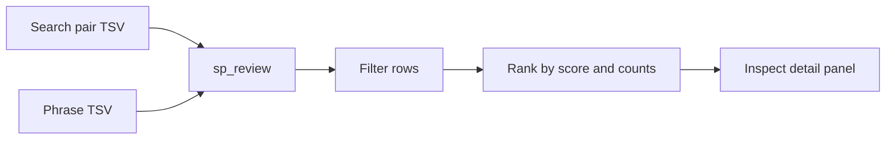
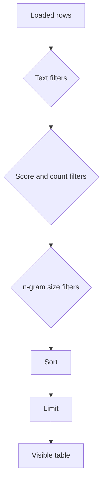

# Review Guide

`sp_review` launches a Gradio UI for inspecting TSV outputs from search or
phrase generation.



## Launch

Review pair search results:

```bash
uv run sp_review \
  --input data/search/es_pt.tsv
```

Review phrase candidates:

```bash
uv run sp_review \
  --input data/search/es_pt.phrases.tsv
```

Bind to a specific host/port:

```bash
uv run sp_review \
  --input data/search/es_pt.tsv \
  --host 127.0.0.1 \
  --port 7860
```

Use `--share` when you want Gradio to expose a temporary public URL:

```bash
uv run sp_review \
  --input data/search/es_pt.tsv \
  --share
```

## What the UI Shows

The review model normalizes both pair TSV and phrase TSV rows into a common
shape:

- source and target text,
- pair or phrase score,
- source and target counts,
- n-gram sizes,
- normalized keys,
- language and corpus metadata when present.

The detail panel checks the formal reverse relation:

```text
reverse(source_norm_key) == target_norm_key
```

For generated phrases, the normalized keys are the concatenated piece keys, so
the same formal check still applies.

## Filters

The UI exposes filters equivalent to the review domain model:

- source text contains,
- target text contains,
- minimum score,
- minimum source count,
- minimum target count,
- source n,
- target n,
- row limit.



Rows are sorted by descending score, then source count, then target count.

## When to Use Review

Use `sp_review` after search to inspect whether the reversible pieces are worth
feeding into phrase generation. Use it after phrase generation to inspect the
final composed candidates.

It is intentionally a review surface, not a generation algorithm. It does not
modify the TSV.

