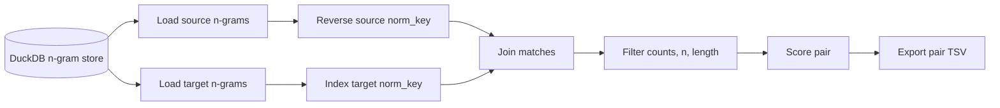
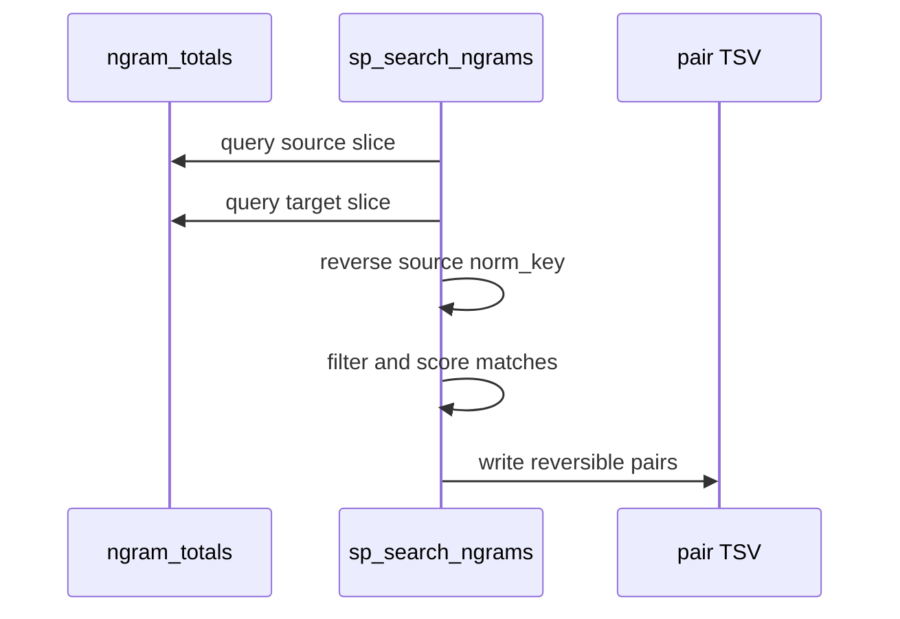

# Search Guide

`sp_search_ngrams` finds bilingual semordnilap pairs from the DuckDB n-gram
store. It does not read raw corpora directly; it searches normalized keys
created by `sp_ngrams`.

The formal rule is:

```text
reverse(source_norm_key) == target_norm_key
```



## Basic Search

```bash
uv run sp_search_ngrams \
  --db-path data/ngrams/counts.duckdb \
  --out data/search/es_pt.tsv \
  --src-lang es \
  --tgt-lang pt \
  --src-corpus wiki \
  --tgt-corpus wiki \
  --min-src-count 5 \
  --min-tgt-count 5
```

The exported TSV is the input for `sp_phrases generate` and can also be opened
directly with `sp_review`.

## Search Space Controls

Use n-gram-size filters when results are too broad:

```bash
uv run sp_search_ngrams \
  --db-path data/ngrams/counts.duckdb \
  --out data/search/es_pt.2x2.tsv \
  --src-lang es \
  --tgt-lang pt \
  --src-corpus wiki \
  --tgt-corpus wiki \
  --src-n 2 \
  --tgt-n 2
```

Use normalized-length filters to avoid tiny accidental matches:

```bash
uv run sp_search_ngrams \
  --db-path data/ngrams/counts.duckdb \
  --out data/search/es_pt.long.tsv \
  --src-lang es \
  --tgt-lang pt \
  --src-corpus wiki \
  --tgt-corpus wiki \
  --min-norm-len 4 \
  --max-norm-len 20
```

Limit output size for quick iterations:

```bash
uv run sp_search_ngrams \
  --db-path data/ngrams/counts.duckdb \
  --out data/search/es_pt.sample.tsv \
  --src-lang es \
  --tgt-lang pt \
  --src-corpus wiki \
  --tgt-corpus wiki \
  --max-results 1000
```

## Count Source

`--counts-source` chooses where counts come from:

- `auto`: use compacted totals when available, otherwise raw partial rows.
- `compact`: require compacted totals.
- `raw`: search raw partial count rows.

Prefer `compact` for stable production runs once compaction is complete.

## Palindromes and Identical Text

By default, search avoids formal matches that are usually less useful:

- palindromic normalized keys,
- identical source/target text in the same language/corpus.

You can include them explicitly:

```bash
uv run sp_search_ngrams \
  --db-path data/ngrams/counts.duckdb \
  --out data/search/es_pt.all.tsv \
  --src-lang es \
  --tgt-lang pt \
  --src-corpus wiki \
  --tgt-corpus wiki \
  --include-palindromes \
  --include-identical-text
```

## Output Columns

Important columns in the pair TSV:

- `source_text`, `target_text`: readable source and target pieces.
- `source_norm_key`, `target_norm_key`: normalized forms used for the reverse match.
- `source_count`, `target_count`: corpus counts.
- `source_n`, `target_n`: n-gram lengths.
- `pair_score`: shared score computed from source and target counts.



