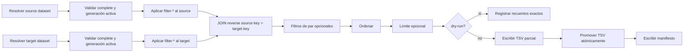

# Búsqueda de semordnilaps

`sp_semord` busca pares reversibles en las generaciones finales de
n-gramas almacenadas en DuckDB. La condición esencial es:

```text
reverse(source_norm_key) == target_norm_key
```

La búsqueda abre la base en modo de solo lectura. No vuelve a tokenizar el
corpus, no consulta staging y no altera los recuentos. Todos los filtros de
esta fase son reversibles: reducen una consulta concreta, pero no eliminan
datos de DuckDB.

La interfaz sigue una regla deliberada:

> Si no se indica ningún `--filter-*`, se conserva todo lo disponible.

Por defecto se usan todos los tamaños de n-grama, todas las frecuencias, todas
las longitudes, las superficies con puntuación, los n-gramas de stopwords, los
palíndromos, los textos idénticos y todos los resultados. Cada reducción debe
pedirse mediante un parámetro cuyo nombre empieza por `--filter-`.

## 1. Requisitos previos

Antes de buscar deben cumplirse estas condiciones:

1. la base usa el esquema generacional actual;
2. los datasets de ambos lados están `complete`;
3. cada dataset tiene una `active_generation`;
4. se conocen los alias exactos `lang/corpus`;
5. si un alias corresponde a varias políticas, se indica su `dataset_id`.

Compruebe primero el estado:

```bash
uv run sp_ngrams db stats \
  --db-path data/ngrams/counts.duckdb \
  --lang gl \
  --corpus corpusnos
```

Si el dataset está `in_progress` pero todos sus documentos están confirmados,
reanude la finalización antes de buscar:

```bash
uv run sp_ngrams db finalize \
  --db-path data/ngrams/counts.duckdb \
  --lang gl \
  --corpus corpusnos
```

## 2. Primera búsqueda recomendada

Como la búsqueda es ilimitada por defecto, conviene medir primero el conjunto
con `--dry-run`. Este ejemplo busca dentro de CorpusNÓS y aplica filtros
exploratorios explícitos:

```bash
uv run sp_semord \
  --db-path data/ngrams/counts.duckdb \
  --src-lang gl \
  --tgt-lang gl \
  --src-corpus corpusnos \
  --tgt-corpus corpusnos \
  --filter-min-src-count 5 \
  --filter-min-tgt-count 5 \
  --filter-min-norm-len 4 \
  --filter-exclude-palindromes \
  --filter-exclude-identical-text \
  --filter-max-results 10000 \
  --dry-run
```

El log muestra los candidatos de cada lado, los pares coincidentes antes del
límite, las filas que se exportarían y la distribución `source_n × target_n`
de las coincidencias antes del límite.
Si el volumen es aceptable, ejecute la misma política quitando `--dry-run` y
añadiendo `--out`:

```bash
uv run sp_semord \
  --db-path data/ngrams/counts.duckdb \
  --out data/search/gl_corpusnos_first.tsv \
  --src-lang gl \
  --tgt-lang gl \
  --src-corpus corpusnos \
  --tgt-corpus corpusnos \
  --filter-min-src-count 5 \
  --filter-min-tgt-count 5 \
  --filter-min-norm-len 4 \
  --filter-exclude-palindromes \
  --filter-exclude-identical-text \
  --filter-max-results 10000
```

Los filtros anteriores no son defaults ocultos. Se han escrito expresamente
porque esta primera inspección busca una salida manejable. Para ampliar la
cobertura se elimina o relaja cada `--filter-*`:

```bash
# Más cobertura: aceptar frecuencias desde 2 y claves desde 3 caracteres.
--filter-min-src-count 2 --filter-min-tgt-count 2 \
--filter-min-norm-len 3

# Solo palabra -> expresión de dos palabras.
--filter-src-n 1 --filter-tgt-n 2

# Todos los resultados: omitir por completo --filter-max-results.
```

## 3. Qué ocurre sin filtros

La forma mínima de medir el universo completo es:

```bash
uv run sp_semord \
  --db-path data/ngrams/counts.duckdb \
  --src-lang gl \
  --tgt-lang gl \
  --src-corpus corpusnos \
  --tgt-corpus corpusnos \
  --dry-run
```

Esto significa exactamente:

| Dimensión | Comportamiento sin `--filter-*` |
|---|---|
| Frecuencia | `count >= 1` en ambos lados: no descarta recuentos almacenados. |
| Tamaño | Acepta todos los valores de `n` disponibles. |
| Longitud | No impone mínimo ni máximo a `norm_key`. |
| Puntuación | Conserva superficies con y sin puntuación. |
| Números | Conserva superficies con caracteres numéricos. |
| Stopwords | Conserva n-gramas formados únicamente por stopwords. |
| Palíndromos | Conserva pares con la misma clave normalizada. |
| Texto idéntico | Conserva el mismo texto al buscar un dataset contra sí mismo. |
| Número de filas | Ilimitado; no existe un valor mágico `0`. |

En un auto-join, este universo puede ser muy grande. Si muchas superficies
comparten una clave palindrómica, el join produce todas sus combinaciones. El
modo `--dry-run` hace un recuento exacto: no escribe ningún archivo, pero sí
ejecuta el join agregado y puede consumir tiempo y memoria similares a la fase
de búsqueda.

## 4. Parámetros

### Entrada, salida y selección

| Parámetro | Obligatorio | Predeterminado | Efecto exacto |
|---|---:|---:|---|
| `--db-path PATH` | no | `data/ngrams/ngrams.duckdb` | Base DuckDB abierta en solo lectura. |
| `--out PATH` | para exportar | — | TSV final. Se puede omitir únicamente con `--dry-run`. |
| `--src-lang LANG` | sí | — | Idioma exacto del dataset fuente. |
| `--tgt-lang LANG` | sí | — | Idioma exacto del dataset objetivo. |
| `--src-corpus NAME` | sí | — | Alias exacto del corpus fuente. |
| `--tgt-corpus NAME` | sí | — | Alias exacto del corpus objetivo. |
| `--src-dataset-id ID` | no | selección por alias | Fija una identidad de extracción fuente. |
| `--tgt-dataset-id ID` | no | selección por alias | Fija una identidad de extracción objetivo. |
| `--dry-run` | no | desactivado | Cuenta candidatos y pares sin escribir TSV ni manifiesto. |
| `--progress-every N` | no | `10000` | Registra progreso cada N filas; `0` desactiva esos mensajes. |

Los parámetros de selección no empiezan por `--filter-` porque no descartan
filas dentro de un dataset: identifican qué datasets participan. Si se omite
un `dataset_id`, debe existir exactamente una identidad para ese
`lang/corpus`; nunca se escoge silenciosamente “la más reciente”.

### Filtros por frecuencia, tamaño y longitud

| Filtro | Predeterminado | Efecto exacto al indicarlo |
|---|---:|---|
| `--filter-min-src-count N` | `1` | Exige `source_count >= N`. |
| `--filter-min-tgt-count N` | `1` | Exige `target_count >= N`. |
| `--filter-src-n N` | sin filtro | Acepta solo source con `n` igual a `1`, `2` o `3`. |
| `--filter-tgt-n N` | sin filtro | Acepta solo target con `n` igual a `1`, `2` o `3`. |
| `--filter-min-norm-len N` | sin filtro | Exige esta longitud mínima de `norm_key` en ambos lados. |
| `--filter-max-norm-len N` | sin filtro | Exige esta longitud máxima de `norm_key` en ambos lados. |
| `--filter-max-results N` | ilimitado | Exporta como máximo N filas después de ordenar. N debe ser al menos 1. |

No se usa `0` como sinónimo de “todos”. La ausencia del filtro expresa que no
hay límite. Si se indican las dos longitudes, el mínimo no puede superar al
máximo.

No se exige que `source_n == target_n`. Esto permite encontrar relaciones
entre una palabra y una expresión:

| Source | `source_n` | Target | `target_n` |
|---|---:|---|---:|
| `roda` | 1 | `a dor` | 2 |
| `animal` | 1 | `la mina` | 2 |

### Filtros por contenido

| Filtro | Predeterminado | Efecto exacto al indicarlo |
|---|---:|---|
| `--filter-exclude-palindromes` | incluidos | Descarta pares donde `source_norm_key == target_norm_key`. |
| `--filter-exclude-identical-text` | incluidos | Descarta el mismo texto cuando coinciden también idioma y corpus. |
| `--filter-exclude-punctuation` | incluida | Descarta el par si cualquiera de sus superficies contiene puntuación. |
| `--filter-exclude-numbers` | incluidos | Descarta el par si cualquiera de sus superficies contiene un carácter numérico Unicode. |
| `--filter-exclude-all-stopword-ngrams` | incluidos | Descarta el candidato de cualquiera de los lados si todos sus tokens son stopwords conocidas para su idioma. |

Los filtros de palíndromo y texto idéntico son independientes. Excluir texto
idéntico no elimina dos superficies distintas que compartan clave. Excluir
palíndromos elimina todas las parejas con claves iguales, sean o no idénticas
sus superficies.

El filtro de números reconoce cualquier carácter cuya categoría Unicode
empieza por `N`. Incluye dígitos decimales (`0`–`9` y sus equivalentes en
otros sistemas de escritura), números con superíndice como `²` y otros
caracteres numéricos. Si aparece en cualquiera de las dos superficies, se
descarta el par completo.

El filtro de stopwords se evalúa en la búsqueda sobre `surface_display`. La
superficie se tokeniza y solo se descarta cuando hay al menos un token y todos
pertenecen a la lista interna del idioma. Si el idioma no tiene vocabulario de
stopwords conocido, no se descarta ningún candidato por esta regla.

## 5. Ejecución de la consulta



SQL conceptual sin filtros opcionales:

```sql
WITH src AS (
    SELECT surface_display AS text, n, count, norm_key, has_punctuation
    FROM ngram_final_v2
    WHERE dataset_id = :source_dataset
      AND generation = :source_active_generation
      AND count >= 1
),
tgt AS (
    SELECT surface_display AS text, n, count, norm_key, has_punctuation
    FROM ngram_final_v2
    WHERE dataset_id = :target_dataset
      AND generation = :target_active_generation
      AND count >= 1
)
SELECT ...
FROM src
JOIN tgt ON reverse(src.norm_key) = tgt.norm_key
ORDER BY (src.count + tgt.count) DESC, src.text, tgt.text;
```

Cada filtro añade una condición a los CTE de candidatos o al resultado del
join. `LIMIT` solo existe en SQL si se indica `--filter-max-results`.

## 6. Dirección y multiplicidad

Una fila representa una relación dirigida `source -> target`. Al buscar un
dataset contra sí mismo, un par puede aparecer en sus dos orientaciones:

```text
source=roda    target=a dor
source=a dor   target=roda
```

No es un error de recuento. Tanto `pair_id` como `lexical_pair_id` son
direccionales. Para análisis no dirigidos hay que escoger una orientación o
crear posteriormente una clave canónica.

Los palíndromos se incluyen por defecto. Si una clave palindrómica tiene `S`
superficies en source y `T` en target, puede aportar hasta `S × T` filas antes
de los filtros de par. Use `--filter-exclude-palindromes` cuando esas
combinaciones no pertenezcan al objetivo del análisis.

## 7. Orden, límite y puntuación

El orden actual es:

```text
source_count + target_count DESC
source_text ASC
target_text ASC
```

Si existe, `--filter-max-results` se aplica después de ese orden. Sin el
parámetro se emiten todas las filas.

La columna exportada `pair_score` se calcula como:

```text
round(ln(source_count + 1) + ln(target_count + 1), 6)
```

Es el logaritmo del producto suavizado. Actualmente se informa y resume, pero
no decide el orden ni filtra resultados.

## 8. Exportación atómica y manifiesto

La exportación adquiere un lock no bloqueante y escribe primero `OUT.part`.
Solo cuando termina y sincroniza correctamente lo promueve a `OUT`; una
excepción durante la iteración conserva intacto cualquier TSV anterior. Al
completar genera `OUT.meta.json` de forma atómica.

Para `data/search/pairs.tsv` se crean:

```text
data/search/pairs.tsv
data/search/pairs.tsv.meta.json
data/search/pairs.tsv.lock
```

El archivo `.lock` registra el proceso propietario y evita dos escritores
simultáneos. El manifiesto incluye:

| Campo | Contenido |
|---|---|
| `sha256`, `artifact_id` | Integridad e identidad reproducible del artefacto. |
| `rows` | Número de filas de datos, sin contar la cabecera. |
| `selection` | Datasets y generaciones exactas de ambos lados. |
| `policy` | Todos los filtros y selectores usados. |
| `ordering`, `score` | Orden y fórmula de puntuación aplicados. |
| `combinations` | Filas por combinación `source_n × target_n`. |
| `punctuated_pairs` | Pares donde al menos una superficie tiene puntuación. |
| `score_summary` | Mínimo, media y máximo del score exportado. |

El manifiesto hace posible auditar una salida incluso si después cambia la
generación activa de un alias.

## 9. Columnas del TSV

| Columna | Significado |
|---|---|
| `pair_id` | Identidad SHA-256 versionada y dirigida, incluyendo corpus. |
| `lexical_pair_id` | Identidad dirigida equivalente, sin incluir corpus. |
| `source_lang`, `target_lang` | Idiomas solicitados. |
| `source_corpus`, `target_corpus` | Alias de corpus solicitados. |
| `source_dataset_id`, `target_dataset_id` | Extracciones inmutables exactas. |
| `source_text`, `target_text` | Superficies legibles almacenadas. |
| `source_n`, `target_n` | Número de tokens léxicos de cada superficie. |
| `source_count`, `target_count` | Frecuencias en sus datasets. |
| `source_norm_key`, `target_norm_key` | Claves que cumplen la relación inversa. |
| `source_has_punctuation`, `target_has_punctuation` | Presencia de puntuación en cada superficie. |
| `pair_score` | Suma logarítmica de frecuencias suavizadas. |

Los IDs no dependen de frecuencias, score ni `dataset_id`. Su identidad aplica
NFC, espacios canónicos y `casefold` a la superficie: ignora diferencias de
caja, pero conserva acentos, puntuación y límites entre palabras.

## 10. Progreso y resumen

Durante una exportación, `--progress-every N` registra las filas escritas y el
tiempo transcurrido cada N pares. Al terminar se informa:

- total de filas y pares con puntuación;
- tiempo total;
- filas por combinación `source_n × target_n`;
- score mínimo, medio y máximo.

Con `--progress-every 0` solo se desactiva el progreso periódico; el resumen
final y el manifiesto se siguen generando.

El `dry-run` informa candidatos source/target, coincidencias totales,
resultado tras el límite opcional y distribución `source_n × target_n` de las
coincidencias anteriores al límite. No crea `--out` ni manifiesto.

## 11. Compatibilidad de políticas de extracción

La consulta usa los `norm_key` almacenados y todavía no compara
automáticamente las políticas de extracción. Para interpretar los resultados,
revise especialmente:

- versión y reglas de normalización;
- conservación o plegado de letras nasales;
- filtros aplicados durante la extracción;
- tratamiento de puntuación y límites de ventana;
- `max_n`.

Los filtros de búsqueda no recuperan datos que una extracción antigua ya haya
descartado. Consulte las identidades y políticas mediante
`sp_ngrams db stats --verbose`.

## 12. Diagnóstico

| Síntoma | Comprobación |
|---|---|
| `No extraction dataset exists` | Verificar `lang/corpus` con `db stats`. |
| `Multiple policy identities` | Añadir `--src-dataset-id` o `--tgt-dataset-id`. |
| `dataset is incomplete` | Ejecutar `db finalize` o reanudar la extracción. |
| Cero filas | Quitar temporalmente filtros de count, longitud, n, puntuación, números o stopwords. |
| Faltan palabra-expresión | No fijar ambos tamaños, o usar `--filter-src-n 1 --filter-tgt-n 2`. |
| Sobran claves iguales | Añadir `--filter-exclude-palindromes`. |
| Sobran autorrelaciones exactas | Añadir `--filter-exclude-identical-text`. |
| Demasiadas filas | Ejecutar primero `--dry-run` y añadir filtros explícitos. |
| Duplicados invertidos | Son orientaciones dirigidas; canonicalizar después. |
| Resultado incompatible con `ñ` | Comparar las políticas de normalización. |

Para inspeccionar la salida y verificar su manifiesto:

```bash
wc -l data/search/gl_corpusnos_first.tsv
head -n 20 data/search/gl_corpusnos_first.tsv
python -m json.tool data/search/gl_corpusnos_first.tsv.meta.json
```

## 13. Búsqueda entre corpus o idiomas

Los lados son independientes. Por ejemplo, español de Wikisource contra
gallego de CorpusNÓS:

```bash
uv run sp_semord \
  --db-path data/ngrams/counts.duckdb \
  --out data/search/es_wikisource_gl_corpusnos.tsv \
  --src-lang es \
  --src-corpus wikisource_20231201 \
  --tgt-lang gl \
  --tgt-corpus corpusnos \
  --filter-min-src-count 5 \
  --filter-min-tgt-count 5 \
  --filter-min-norm-len 4 \
  --filter-max-results 10000
```

Invertir source y target es otra búsqueda y produce identidades dirigidas
diferentes.

## 14. Mejoras pendientes

La búsqueda ya dispone de salida atómica, manifiesto, filtros no destructivos
de puntuación, números y stopwords, `dry-run`, progreso, distribución por tamaños y
límite opcional sin valor mágico. Permanecen como mejoras posibles:

1. comparar automáticamente las políticas de extracción de source y target;
2. añadir un modo no dirigido con una única orientación e ID canónico;
3. permitir escoger el criterio de orden y filtrar por `pair_score`;
4. admitir horquillas de longitud y score diferentes para cada lado;
5. perfilar si una clave inversa materializada mejora el join en bases grandes;
6. proporcionar una operación separada para deduplicar o agregar TSV.
