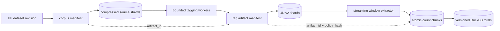

# RFC 0001: Harden and reduce the core pipeline

Status: implemented  
Date: 2026-10-04  
Scope: corpus download, contextual tagging, n-gram extraction and repository
cleanup

Historical scope note: the RFC's UPOS-aware n-gram path was later superseded
by [ADR 0009](../adr/0009-text-only-ngram-schema-v3.md). Tagging remains an
independent utility; current n-gram extraction is text-only.

## Summary

Make `corpus -> tagging -> n-grams` the supported product boundary. Before
running full tagged extractions, fix the normalization and input-detection
errors, give extraction an idempotent run/checkpoint model, and prevent counts
from different policies from sharing an identity. Then move tagged artifacts
to compressed shards and stop retaining duplicate raw and compact count sets
indefinitely.

Remove `app`, `review` and `phrases` in a separate, reviewable cleanup. The same
cleanup should evaluate the older extraction, embedding, candidate, FreeLing
and dictionary-search paths. Keep the modern DuckDB search temporarily as an
optional consumer unless the project explicitly narrows to data preparation
only.

The audit text below is retained as historical rationale. Its delivery and
acceptance criteria were implemented by
[plan 0002](../plan/0002-core-pipeline-hardening.md) and decisions were
captured in ADRs 0005–0007. No user corpus, tagged partial or DuckDB data was
deleted during the source cleanup.

Implementation note (2026-10-04): checkpoint v2 stores source/output byte
cursors and upgrades legacy partials through one visible resumable indexing
pass. The later implementation also added sharded tagged v2, transactional
n-gram generations, artifact manifests and repository cleanup.

## Goals and non-goals

Goals:

- make long-running stages restartable without duplicate or mixed results;
- preserve contextual UPOS evidence and cross-sentence punctuation windows;
- bound memory and disk growth on large corpora;
- make artifacts reproducible and reject incompatible inputs early;
- reduce the repository and dependency set to the capabilities in active use;
- retain a migration path for current tagged JSONL v1 files and DuckDB data.

Non-goals:

- redesign semordnilap search or scoring;
- revive phrase generation or either review UI;
- change active partial tagging files in place;
- choose a distributed processing platform before local bottlenecks are
  measured after the proposed fixes.

## Audit basis

The review covered the corpus, tagging and n-gram source, their CLIs and tests,
the package dependency graph, current documentation, and existing local
artifacts. No write was made to corpus, tagged or DuckDB data.

Observed scale at the audit snapshot:

- source corpora include 37,831 Spanish documents (369 MiB) and 747 Galician
  documents (6.5 MiB);
- the first 188 Galician source records occupy about 2.26 MB, while their
  tagged JSONL occupies about 97.4 MB: roughly 43x expansion for that prefix;
- `data/ngrams/counts.duckdb` is 3.8 GiB;
- that database contains 150,278,232 raw rows and 76,112,039 compact rows;
- both sets represent the same 306,500,246 occurrences, so compaction currently
  duplicates logical data instead of replacing staging data;
- the complete test suite passed during this audit, while full Ruff reports
  five errors in the legacy Dear PyGui app.

The expansion ratio is workload-specific, not a promised global ratio. It is
large enough to require capacity planning before completing the Spanish run.

## Findings

Severity means:

- **P0**: can silently produce incorrect or unrecoverable results;
- **P1**: likely to block a full-scale run or materially inflate its cost;
- **P2**: maintainability, observability or future correctness gap.

### Correctness and reproducibility

| Priority | Finding | Consequence | Proposal |
|---|---|---|---|
| P0 | `--format auto` classifies `*.ud.jsonl` as ordinary JSONL. | Tagged input is silently retokenized and all UPOS evidence is lost unless `--format ud-jsonl` is supplied. | Detect the schema from the first record, or require a distinct format/manifest and fail on ambiguity. |
| P0 | `strip_accents` removes the combining tilde from `ñ`; `--fold-nasal-letters` therefore yields `nino` both on and off. | Spanish and Galician normalized keys collide contrary to the CLI contract. | Define normalization examples as golden tests and preserve `ñ` unless folding is explicitly enabled. Version the normalization policy. |
| P0 | Extraction commits counts but records no processed document or chunk identity. | Restarting appends duplicates; using `--reset` discards all previous progress. | Add run and chunk ledgers with a unique input/policy identity and atomic chunk commits. |
| P0 | Plain `add_counts` can commit one or more COPY batches before compacted totals are invalidated. | A crash can leave raw counts newer than totals while `auto` still selects stale compact data. | Put batch append, chunk ledger and compaction invalidation in one transaction. |
| P0 | `lang + corpus` is the only dataset identity. Token limits, punctuation mode, normalization, input artifact and tagger version are absent. | Reruns with different policies are silently summed into one corpus. | Address counts by immutable `artifact_id + policy_hash`; treat the human corpus name as a label. |
| P0 | Plain and annotated extraction use different surface rules. Plain unigrams can include following punctuation (`niña,`), while tagged unigrams stop at the lexical token. | The same text creates incompatible keys depending on the adapter. | Define one canonical surface algorithm and run adapter conformance tests against the same fixtures. |
| P1 | Product intent says punctuation-crossing is always enabled, but the CLI default remains `--omit-punctuation`. | A missed flag changes the dataset silently and prevents examples such as `niña, el`. | Make crossing the invariant/default; later remove the unused branch after a compatibility period. |
| P1 | Exact tagged spans retain tabs/newlines and are lowercased, while plain input normalizes whitespace. | Equivalent surfaces split across rows; TSV can contain multiline records; “exact surface” is not actually exact case. | Separate `surface_display`, canonical `surface_key` and original span coordinates. Normalize whitespace in the key only. |
| P1 | `--export-source compact` in the n-gram repository does not verify that compact totals exist. | Export can succeed with zero or incomplete rows. | Validate completeness against run metadata, as the modern search adapter already attempts to do. |
| P1 | Tagged extraction accepts any complete-looking JSONL without consulting its final manifest. | A renamed partial or mixed file can be counted as final input. | Require a completed artifact manifest by default; provide an explicit unsafe override for recovery. |
| P1 | Corpus records with missing/empty text are written and counted for progress, then skipped by tagging. | Progress totals and document counts disagree. | Validate/filter once at corpus creation and record rejected-row totals in the manifest. |
| P1 | `--limit-docs` outputs are finalized under the normal artifact/corpus identity. | A smoke sample can look complete, and a later extraction can mix or duplicate its prefix. | Mark samples explicitly in manifests and identities; never promote them as complete full-corpus artifacts. |
| P1 | Tagging resume formerly omitted input format and text/id fields. Checkpoint v2 now records them and a size/mtime source snapshot, but not a content digest. | Ordinary source/configuration changes are rejected; adversarial or same-size/same-mtime replacement is not cryptographically detected. | Add a source artifact ID/checksum when corpus manifests are introduced. |
| P1 | No process lock protects a tagged partial or DuckDB extraction identity. | Two writers can corrupt JSONL or double counts. | Acquire an advisory lock containing PID/host/start time; refuse concurrent ownership unless explicitly recovered. |
| P2 | `AnnotatedToken.from_dict` does not coerce list-form token IDs to integers. | Invalid schema values can survive deserialization despite the declared type. | Validate every ID and offset at the boundary. |
| P2 | Domain validation does not prove token ordering, non-overlap or `text[start:end] == token.text`. | A malformed adapter can produce believable but incorrect spans and surfaces. | Add strict structural validation with an optional fast mode only after trusted artifact verification. |
| P2 | N-gram CLI validation omits negative `limit_docs`, inconsistent token lengths and empty corpus labels. | Invalid options can produce an empty or surprising run without a clear error. | Centralize policy validation in the domain command, not only in argparse. |
| P2 | Stanza metadata records package names and library version, not exact model checksums. | The same command can produce different annotations after model replacement. | Hash model files/resources and include the model manifest in the artifact identity. |
| P2 | `db stats` opens the read-write repository and runs schema creation/migration. | A command presented as inspection can mutate an older database. | Open stats read-only and move migrations to an explicit command. |
| P2 | Reset/delete operations and TSV export are not atomic. | Interruption can leave a partially deleted database or a truncated final TSV. | Wrap multi-table deletion in a transaction and export through a partial file plus atomic promotion. |

### Failure recovery

Corpus download currently opens the final JSONL directly. A network, parsing or
disk failure leaves a truncated final-looking artifact and there is no resume
position. It should use the same artifact lifecycle as later stages:

```text
planned -> writing shards -> validating -> complete
                         \-> failed/recoverable
```

At audit time, tagging resume was linear in completed output:

1. deserialize the whole partial to recover counts;
2. reread the source prefix;
3. deserialize the partial again while comparing that prefix;
4. continue with the next source document.

This item has since been resolved by checkpoint v2. Current runs seek directly
to both streams. A legacy partial performs the validation/deserialization once
with byte progress; periodic `recovering` checkpoints make that migration
restartable. Model loading occurs only after recovery, so its memory does not
overlap the large legacy scan.

As Spanish output grows into gigabytes, every restart becomes increasingly
expensive. A crash after final-file promotion but before manifest creation can
also leave a complete artifact with no supported finalize path.

N-gram extraction has no resume protocol. Its current append behavior is useful
for intentionally merging corpora but indistinguishable from an accidental
retry. `--reset` is destructive at the beginning rather than an atomic swap at
the end.

Proposed common recovery contract:

- immutable source artifact ID;
- immutable semantic configuration hash;
- run ID and explicit state;
- ordered chunk IDs with unique constraints and input digests;
- one transaction for chunk data plus checkpoint;
- atomic promotion/final table swap after validation;
- `resume`, `restart` and `append-as-new-source` as distinct operations.

### Scalability

#### Corpus acquisition

- `load_dataset` materializes/cache-manages the selected dataset before JSONL
  export; the final uncompressed JSONL duplicates cached data on disk.
- There is no download/export progress at document or byte level.
- `--write-text` performs a second pass and creates a third representation.
- Dataset name and date are recorded only in the filename, with no Hugging Face
  revision, schema snapshot or checksum manifest.
- Multiple languages are sequential; a later failure leaves a partially
  completed multi-language request with no top-level manifest.
- The default language pair is still Spanish/Portuguese, while the current
  contextual core is Spanish/Galician.

Proposal: stream or memory-map intentionally, write compressed shards, pin the
dataset revision, and produce one manifest per language plus a collection
manifest. Keep JSONL as an interchange adapter, not necessarily the primary
large-scale representation.

#### Contextual tagging

- Stanza parses one entire source document; the domain tree, `to_dict` tree and
  serialized JSON string coexist at peak memory.
- JSONL v1 repeats original text as token text, word text, lemma, spacing and
  metadata. The n-gram stage needs only original text, spans, sentence index,
  UPOS slots and optionally morphology.
- A single giant physical line makes validation and recovery proportional to
  the largest document.
- Processing is single-pipeline and single-process; CPU runs cannot exploit
  document parallelism, while unbounded workers would duplicate large models.
- One final file creates a large failure domain and cannot be consumed safely
  until complete.

Proposal: introduce a v2 adapter with compressed, independently finalized
shards. Store token spans and UD attributes once; reconstruct token text from
the document. Make lemma/XPOS optional profiles and retain `feats` for future
grammar checks. Use bounded workers or Stanza batch APIs only after measuring
one-worker throughput and memory. Preserve output order through document
ordinals.

Long documents need an explicit policy. Paragraph/sentence chunking lowers peak
memory but can alter tokenization at split boundaries. If adopted, splits must
use deterministic safe boundaries, maintain global offsets and record boundary
provenance; oversize unsplittable documents should be quarantined rather than
crashing the complete run.

#### N-gram generation

- Annotated extraction first builds a lexical-token list for the full document
  and then a per-document `Counter` before the global pending counter is
  checked. One pathological document can exceed the configured memory bound.
- Tagged flush builds a base `Counter`, a base-row list and a UPOS-row list in
  addition to the pending counter.
- Punctuation and whitespace variants increase textual cardinality sharply;
  UPOS patterns multiply fact rows again.
- All unigrams, bigrams and trigrams, including hapaxes, are persisted before
  any export threshold is applied.
- The current tokenizer accepts only a fixed Latin letter range in the raw
  path, while the tagged path accepts Unicode-letter-only Stanza tokens. Words
  containing apostrophes/hyphens and decomposed combining marks can therefore
  be split, dropped or treated differently by adapter.

Proposal: generate windows as an iterator into a bounded accumulator, flush
within a document, canonicalize surface whitespace, and expose memory/row/byte
thresholds rather than document count alone. Measure the fraction of hapaxes
before deciding between exact two-pass filtering, an approximate first pass or
keeping all rare forms.

#### DuckDB storage

The append-then-compact design favors fast writes but permanently retains both
representations. At the observed scale, raw and total relations contain about
226 million rows combined before adding UPOS relations.

Preferred target:

1. extract each resumable chunk into an atomic, compressed staging shard
   (Parquet is a candidate, not yet a decision);
2. validate chunk counts and checksums;
3. build total and UPOS-total tables in a new generation using DuckDB scans;
4. atomically switch the active generation;
5. delete staging only after validation and an explicit retention window.

This makes raw data recoverable during the run without requiring it to remain
inside the final database. A smaller interim change can retain raw tables but
add `run_id`, `chunk_id`, unique chunk commits and transactional invalidation.

Additional storage proposals:

- add a schema-version table and explicit migrations;
- record run status, artifact ID, policy JSON/hash and software revision;
- enforce uniqueness where it represents an invariant;
- validate `SUM(text counts) == SUM(UPOS counts)` for tagged runs;
- record rejected documents and filtered occurrence totals;
- use generation tables or database-file promotion for destructive rebuilds;
- configure and report DuckDB memory, temporary directory and free disk space;
- benchmark direct totals merge versus external staging before choosing;
- run `CHECKPOINT`/space reclamation intentionally and document retention.

### Observability and tests

Tagging now also reports byte progress while indexing a legacy partial, but
normal annotation remains document-oriented. Document sizes vary enough that
a bar can appear stalled for a long time. Every long stage should report documents,
input bytes, tokens, generated occurrences, unique pending keys, committed
chunks, throughput, elapsed time and an ETA when stable. A heartbeat should be
emitted while a single large document is inside Stanza.

Missing or weak test areas:

- no dedicated tests for corpus export, truncation or resume;
- no golden normalization test distinguishing `ñ` preservation from folding;
- no automatic tagged-format detection test;
- no adapter-conformance suite comparing raw and tagged surface semantics;
- no n-gram fault injection between COPY, invalidation and checkpoint;
- no concurrent-writer test;
- no migration test against a copy of an older multi-gigabyte schema;
- no property tests for offsets, Unicode normalization and punctuation;
- no performance budgets for peak RSS, rows/second or disk amplification;
- Stanza conversion is tested with fakes but not a pinned miniature real model
  in an optional integration suite.

Recommended quality gates:

- fast unit/contract tests on every change;
- fault-injection integration tests for every transaction boundary;
- a small checked-in corpus fixture with golden artifact hashes;
- nightly/explicit real-model ES and GL tests;
- benchmark reports for 10k, 1M and representative long-document samples;
- Ruff over the supported tree immediately, and over the full tree after
  legacy removal; add typing only after the boundary models are stabilized.

## Proposed target architecture



Every arrow is an adapter boundary with a manifest. Every box on disk is either
explicitly incomplete or verifiably complete. A provider change affects the
tagging adapter and artifact identity, not n-gram domain logic.

### Suggested artifact identities

`corpus_artifact_id` should derive from dataset/revision/config plus ordered
source-shard digests. `tag_artifact_id` should derive from the corpus artifact,
schema version, language, adapter/model digest and tagging profile.
`extraction_policy_hash` should include at least:

- max n and token/normalized-length filters;
- stopword policy and stopword-list version;
- punctuation/cross-sentence policy;
- Unicode and nasal-letter normalization version;
- surface canonicalization version;
- code/schema revision when behavior is not otherwise versioned.

Human names such as `wikisource_20231201` remain aliases and must not be the
sole key for accumulation.

### Tagged schema evolution

Keep the existing provider-neutral domain, but distinguish logical content
from physical encoding:

- logical contract: document, sentence order, global spans, surface token,
  underlying UD words, UPOS and optional UD features;
- physical v1: current one-document-per-line JSONL;
- proposed physical v2: compact records in compressed shards plus manifest;
- readers: accept v1 and v2 during migration;
- writers: emit only the selected current version;
- no in-place rewrite of active `.part` files.

## Repository reduction

### Recommended disposition

| Component | Disposition | Reason |
|---|---|---|
| `corpus` | Keep and harden | Core acquisition stage. |
| `tagging/domain.py`, `io.py`, `application.py`, `stanza.py`, `cli.py` | Keep and harden | Core contextual UPOS stage. |
| `ngrams` | Keep and harden | Core extraction and storage stage. |
| `utils` | Keep, then narrow | Shared by the core; split normalization versions explicitly. |
| Modern `search/application`, `domain`, `infrastructure`, `cli` | Keep temporarily as optional | It is the direct consumer that proves n-gram usefulness; decide separately whether data preparation alone is the product. |
| `app` | Remove | Broken Ruff state, Dear PyGui dependency, superseded workflow. |
| `review` | Remove | User-declared unused; removes Gradio and its transitive surface. |
| `phrases` | Remove | User-declared unused; removes spaCy/KenLM/OmegaConf integration and a large test/config surface. |
| `tagging/freeling.py`, `tagging/main.py`, `scripts/freeling_analize.sh` | Remove after confirming no external caller | Superseded by the provider-neutral Stanza CLI; old analyzer ignores its `config` argument and loses repeated-token analyses. |
| `extract`, `candidates`, `embed`, `load.py`, `lang`, legacy `search/engine.py` | Audit then remove or archive | These are older parallel workflows, not dependencies of the three-stage core. |
| `scoring` | Keep only if modern search remains | Otherwise it is downstream-only. |

### Console scripts

The minimal supported set is:

```text
sp_corpus_wikisource
sp_tag
sp_ngrams
```

Keep `sp_search_ngrams` only if modern search remains optional. Proposed
removals are `sp_app`, `sp_review`, `sp_phrases`, `sp_dict`, `sp_cand` and the
legacy `sp_find`. The generic `semordnilap` command currently only prints a
placeholder and should either become a real umbrella CLI or be removed.

### Dependencies

After the code removal, the direct runtime set should be recomputed from
imports. The expected core is approximately `datasets`, `duckdb`, `stanza` and
`tqdm`; `huggingface-hub` need not be direct unless core code imports it.
Likely removable direct dependencies include Dear PyGui, Gradio, FAISS,
sentence-transformers, spaCy, KenLM, OmegaConf and wordfreq. NumPy/torch may
remain transitively required by Stanza and must not be pinned directly without
a core reason.

Cleanup must update source, console scripts, tests, docs, dependency metadata
and the lockfile in one change. Removing dependencies without deleting their
entry points leaves installations that succeed but commands that fail at
runtime.

### Safe deletion order

1. Decide whether modern `sp_search_ngrams` is retained.
2. Record a baseline of supported CLI help and core tests.
3. Remove named console scripts and legacy documentation references.
4. Delete `app`, `review` and `phrases` with their tests.
5. Delete confirmed-unused older pipelines and FreeLing files separately.
6. Remove now-unreferenced dependencies and regenerate `uv.lock`.
7. Run import, CLI, unit and end-to-end checks from a clean environment.
8. Measure install size/time and record the reduced supported surface.

Do not delete `data/search`, language models, current tagged partials or the
existing DuckDB as part of source cleanup. Data retention is a separate,
explicit operation.

## Delivery sequence

The smallest safe sequence is four changesets:

1. **Contracts and correctness:** freeze golden fixtures; fix format detection,
   normalization, canonical surfaces, option validation and artifact identity.
2. **Idempotent execution:** transactional run/chunk ledgers, locks, manifests,
   atomic output promotion and recovery tests for all three stages.
3. **Scale:** tagged v2 shards, bounded in-document extraction, storage
   generations/staging retirement, metrics and representative benchmarks.
4. **Repository cleanup:** remove unused applications, scripts, tests and heavy
   dependencies; decide the status of modern search.

The cleanup can be prepared independently, but artifact semantics should be
fixed before spending days producing full new corpora. Existing v1 partials
must remain readable throughout the migration.

## Acceptance criteria

- Omitting `--format` can never silently discard available UPOS annotations.
- `ñ` remains distinct from `n` unless an explicitly versioned policy folds it.
- Replaying any committed chunk changes no count.
- Changing a semantic policy creates a new extraction identity or fails fast.
- Raw and annotated adapters produce the same canonical surfaces for the same
  token/span fixture.
- Every final artifact has a manifest, checksum, schema version and complete
  status; incomplete artifacts are rejected by default.
- A forced interruption at every persistence boundary can resume without loss
  or duplication.
- Peak application memory is bounded independently of corpus size and of one
  pathological document.
- Staging retention is explicit; the final store does not permanently require
  both 150M raw and 76M compact rows for the current workload.
- ES and GL real-model smoke tests pass with pinned model metadata.
- The default supported install exposes only approved commands and does not
  install UI, embedding or phrase-generation stacks.

## Resolved decisions

Modern DuckDB search remains an optional supported consumer. Tagged v2 uses
gzip JSONL shards and defaults to UPOS+FEATS; `full` adds lemma/XPOS. Text keys
use NFC, Unicode case-folding and collapsed whitespace while display preserves
a normalized source spelling. All accepted frequencies are persisted and
filtering belongs to export. Staging is removed immediately after a validated
generation unless explicitly retained. Benchmarks report the current machine
rather than imposing a hardware-specific gate.
