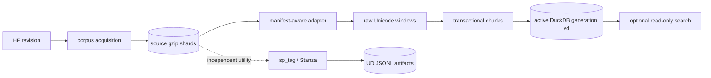
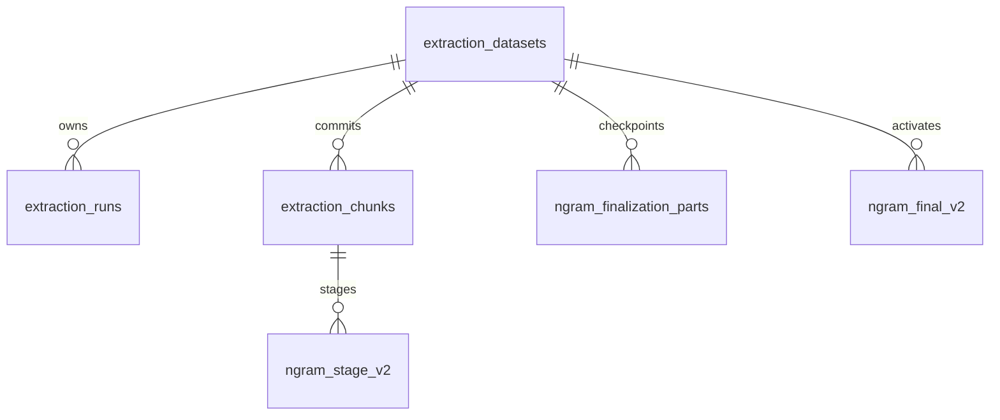

# Arquitectura técnica

Estado implementado a 2026-10-06.

## Flujo de n-gramas

La referencia detallada, con el recorrido fila a fila y todas las tablas, está
en [Extracción moderna de n-gramas](ngram-extraction.md).



La rama de tagging es independiente. `sp_ngrams` no importa su modelo de
dominio, no lee `ud-jsonl` y no persiste UPOS.

| Capa | Módulos | Responsabilidad |
|---|---|---|
| Corpus | `corpus/{cli,wikisource,corpusnos}.py` | selección, export streaming, shards, revisión y resume |
| N-gram domain | `ngrams/domain/*` | tokenización Unicode, ventanas, filtros y normalización |
| N-gram application | `ngrams/application/*` | identidad, chunks, resume y exportación |
| Source adapters | `ngrams/infrastructure/corpus_adapters.py` | resolución segura de colecciones, idioma y shards |
| Storage | `ngrams/infrastructure/repositories.py` | esquema v4, migración y generaciones DuckDB |
| Search | `search/*` | consumidor opcional sólo lectura |
| Tagging | `tagging/*` | utilidad UD independiente, sin integración con n-gramas |
| Shared | `utils/artifacts.py`, `utils/io.py`, `utils/text.py` | checksums, locks, manifests e I/O |

## Artefactos e identidad

Los corpus gestionados tienen manifiesto versionado, estado, configuración,
checksums, procedencia y `artifact_id`. Un manifiesto de colección enumera de
forma autoritativa sus hijos; los adaptadores no consumen directorios `.part`,
artefactos incompletos ni hijos no declarados.

`dataset_id` deriva del artefacto fuente, el hash de política, idioma y alias
de corpus. `chunk_id` identifica un segmento determinista. Cambiar una opción
semántica crea otra identidad y repetir un chunk ya confirmado es un no-op.

La búsqueda exporta un `pair_id` ligado a los alias de corpus y un
`lexical_pair_id` independiente de ellos. Ambos usan la superficie canónica,
son insensibles a caja y no dependen de frecuencias ni de `dataset_id`. Los
IDs de dataset se exportan por separado para conservar la procedencia exacta
sin impedir comparaciones entre nuevas muestras del mismo corpus.

## Ventanas y superficie

El extractor recorre spans lexicales Unicode sobre cada documento fuente. Una
deque de tamaño `max_n` permite ventanas que atraviesen puntuación y límites
de frase, pero se vacía al terminar cada documento. La superficie comprende
desde el primer token léxico hasta el final del último y conserva la puntuación
intermedia.

- `surface_key`: NFC, case-folding Unicode y espacios colapsados;
- `surface_display`: grafía de origen con espacios normalizados;
- `norm_key`: clave compacta sin puntuación ni acentos para invertir;
- `has_punctuation`: presencia de puntuación en la superficie.

No existe una propiedad `crosses_sentence`: sin tagging no hay un límite de
frase anotado fiable, y la superficie ya permite observar la puntuación.

## DuckDB schema v4



Los sufijos `_v2` de las tablas de generación se mantienen para preservar los
datos modernos existentes; la versión del esquema global es 4. Cada chunk confirma en
una transacción sus recuentos textuales, ledger y cursor. La finalización agrega
por `n` y bucket, confirma cada parte por separado, activa la generación en una
transacción corta y después retira el staging.

No existe una segunda ruta de recuentos ni una operación de compactación. Los
lectores consumen únicamente la generación activa de `ngram_final_v2`.

## Migración

Una apertura de escritura exige esquema actual. La única actualización
permitida es explícita:

```bash
uv run sp_ngrams db migrate --db-path DB
```

La única migración admitida es v3→v4 y se ejecuta en una transacción. Preserva
datasets, chunks, staging, checkpoints de finalización y generaciones finales;
elimina las tablas obsoletas `ngram_counts`, `ngram_totals` y
`ngram_compactions`. Las versiones v0–v2 requieren reextracción o conversión
externa. Una versión superior a 4 se rechaza incluso en modo de lectura.

## Límites y recuperación

| Etapa | Límite principal | Recuperación |
|---|---|---|
| Corpus | fila + shard actual | último shard confirmado |
| Extracción | deque `max_n` + contador configurado | último documento/segmento transaccional |
| Finalización | un bucket de un tamaño `n` | último bucket confirmado |
| Exportación | una fila + buffer de archivo | final anterior intacto |

## Verificación

```bash
uv run pytest -q
uv run ruff check .
```

Las pruebas cubren fallos inyectados, replay, identidades múltiples,
adaptadores de corpus, migración v3→v4, idempotencia, rechazo de esquemas
antiguos/futuros y ausencia de las tablas de compactación retiradas.
