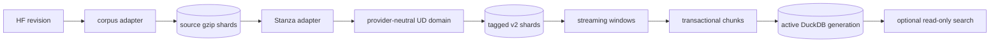
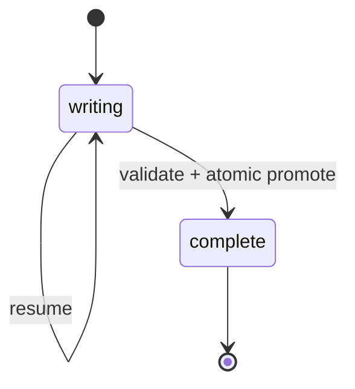
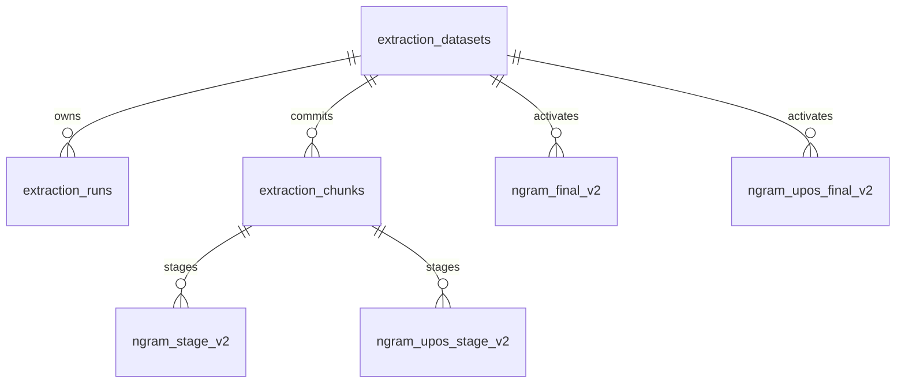

# Arquitectura técnica

Estado implementado a 2026-10-04.

## Componentes



| Capa | Módulos | Responsabilidad |
|---|---|---|
| Corpus | `corpus/{cli,wikisource,corpusnos}.py` | selección de fuente/subconjuntos, export streaming, shards, revisión y resume |
| Tagging domain | `tagging/domain.py` | contrato neutral, UPOS, spans, v1/v2 |
| Tagging adapters | `tagging/stanza.py`, `tagging/io.py` | Stanza y lectura streaming |
| Tagging application | `tagging/application.py`, `tagging/sharded.py` | checkpoints v1, shards v2, splitting y cuarentena |
| N-gram domain | `ngrams/domain/*` | tokenización Unicode, ventanas y normalización |
| N-gram application | `ngrams/application/*` | identidad, chunks, resume y export |
| Storage | `ngrams/infrastructure/repositories.py` | migraciones y generaciones DuckDB |
| Search | `search/*` | consumidor opcional sólo lectura |
| Shared | `utils/artifacts.py`, `utils/io.py`, `utils/text.py` | checksums, locks, manifests e I/O |

Las dependencias runtime directas son `datasets`, `duckdb`, `stanza` y `tqdm`.

## Ciclo de vida de artefactos



Todo artefacto nuevo contiene schema/version, estado, configuración semántica,
provenance, checksums y `artifact_id`. Los writers mantienen un lock POSIX no
bloqueante con PID/host. Un consumidor rechaza tagged data incompleto salvo
`--allow-incomplete-input` explícito.

Los corpus y tagged v2 son directorios de shards gzip confirmados
independientemente. Un fallo sólo invalida el shard temporal. La promoción del
directorio completo ocurre después de escribir el manifiesto final.

## Contrato UD

El modelo lógico contiene documento, texto original, frases ordenadas, offsets
Python absolutos, tokens de superficie, palabras UD, UPOS y FEATS. Se validan
IDs, orden, no solapamiento y `text[start:end] == token.text`.

- v1: una línea/documento, campos verbosos con lemma/XPOS; continúa legible y
  su protocolo de checkpoint por bytes sigue disponible.
- v2 compact: JSONL gzip sharded; token text se reconstruye del span, mantiene
  word text, UPOS y FEATS.
- v2 full: añade lemma y XPOS.

Documentos largos se dividen antes de Stanza en límites seguros. Cada
fragmento se etiqueta con contexto local, después se desplazan offsets y
índices a coordenadas globales. El manifiesto/document metadata registra los
límites; tramos indivisibles o errores pueden cuarentenarse.

## Semántica de ventanas

El etiquetado precede a cualquier extracción. El extractor recorre todos los
tokens lexicales del documento con una deque de tamaño `max_n`; por ello
conserva el UPOS contextual y permite ventanas entre frases. El span desde el
primer hasta el último token conserva la puntuación intermedia. Un límite de
documento siempre vacía la ventana.

Raw y tagged comparten la misma superficie canónica. La identidad textual y
la evidencia gramatical están separadas: una fila textual agregada se relaciona
con varios patrones UPOS y sus frecuencias.

## DuckDB v2



`dataset_id` deriva del artefacto fuente y `policy_hash`; `chunk_id` identifica
un segmento determinista. COPY masivo, staging, ledger y cursor se confirman en
una transacción. La finalización agrega una nueva generación, valida totales,
activa y elimina staging en otra transacción. El replay de un chunk es no-op.

Las migraciones son explícitas. Inspección, export y búsqueda abren read-only.
Alias ambiguos requieren el `dataset_id`; nunca se mezclan políticas.

## Límites de memoria y recuperación

| Etapa | Límite principal | Recuperación |
|---|---|---|
| Corpus | fila + shard actual | último shard confirmado |
| Tagging v2 | modelo + fragmento <= límite + shard | cursor del último shard |
| Tagging v1 | modelo + documento | offsets fuente/salida; indexación legacy una vez |
| Extracción | deque `max_n` + contador configurado | último documento/segmento transaccional |
| Finalización | memoria/temporales administrados por DuckDB | rollback de generación |
| Export | una fila + buffer de archivo | final anterior intacto |

Stanza mantiene un pipeline por proceso. No se multiplican modelos por defecto:
el RFC condicionó workers/batching a mediciones, y el diseño actual prioriza un
pico de memoria predecible. El heartbeat distingue un documento lento de un
bloqueo.

## Calidad y medición

```bash
uv run pytest -q
uv run ruff check .
uv run sp_tag smoke --langs es gl --model-dir data/models/stanza
uv run python scripts/benchmark_core.py --windows 10000 1000000 \
  --oversized-document
```

Los tests incluyen fallos inyectados antes de commits, replay, resume,
identidades múltiples, locks, manifests, compatibilidad v1/v2, splitting y
cuarentena. Los benchmarks informan resultados, no fijan presupuestos ligados
a una máquina concreta.
