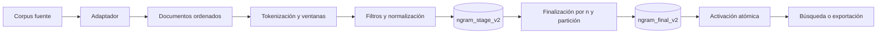
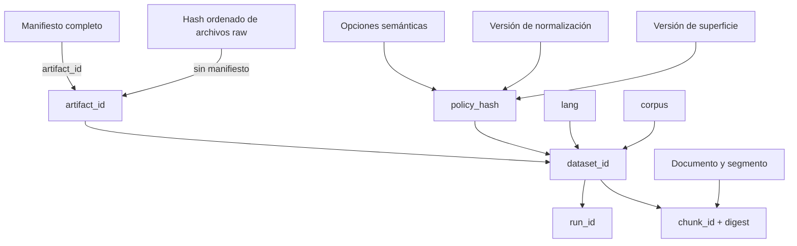
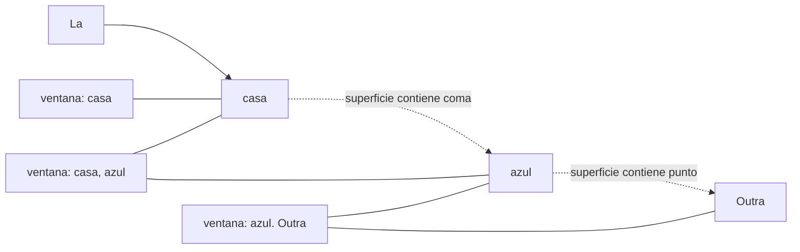
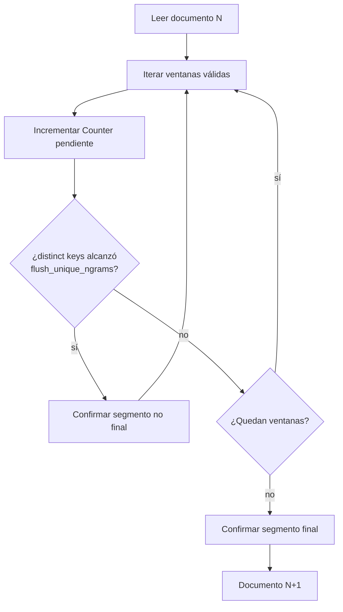
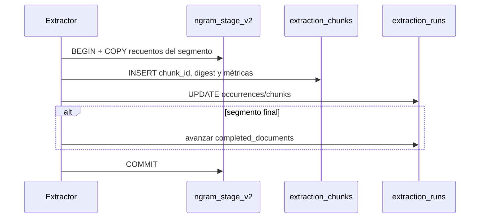
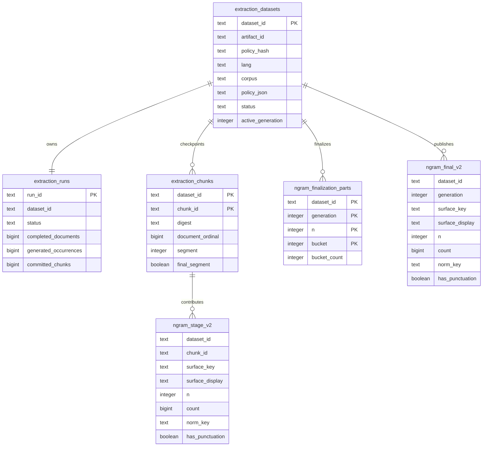
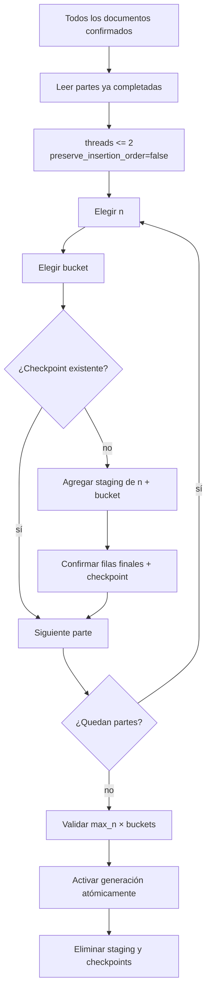
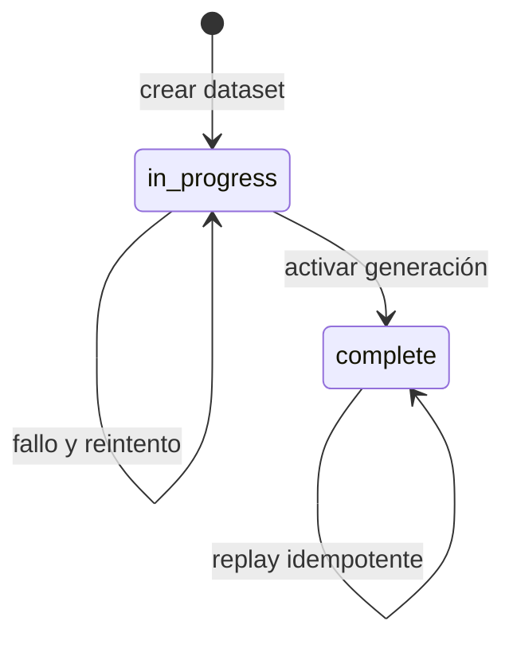
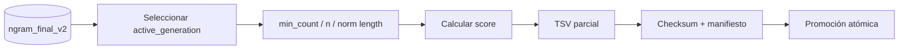

# Extracción moderna de n-gramas: diseño y recorrido del dato

Este documento describe exactamente cómo `sp_ngrams extract` transforma un
corpus de texto en una generación consultable de n-gramas dentro de DuckDB.
Incluye el recorrido del dato, las reglas textuales, las identidades, las
transacciones, las tablas físicas y la recuperación después de una
interrupción.

La idea central es separar tres estados:

1. el corpus fuente, que tiene una identidad estable;
2. los recuentos parciales confirmados por documento o segmento;
3. una generación final que solo se hace visible cuando está completa.



## 1. Vocabulario

| Término | Significado |
|---|---|
| Artefacto | Corpus fuente concreto, identificado por un `artifact_id`. |
| Política | Todas las opciones que pueden cambiar qué n-gramas se producen. |
| Dataset | Combinación inmutable de artefacto, política, idioma y alias de corpus. |
| Run | Ejecución determinista asociada a un dataset. |
| Documento | Una línea TXT o un registro JSONL con texto. |
| Segmento | Parte de los recuentos de un documento limitada por memoria. |
| Chunk | Segmento confirmado transaccionalmente, incluido el segmento final vacío o no vacío del documento. |
| Staging | Recuentos parciales y recuperables de todos los chunks. |
| Parte de finalización | Un par `(n, bucket)` agregado y confirmado. |
| Generación | Totales consolidados que pueden activarse para lectura. |
| Alias `lang/corpus` | Nombre humano para localizar datasets; no es su identidad completa. |

## 2. Ejecución normal

Un ejemplo para la colección completa de CorpusNÓS:

```bash
uv run sp_ngrams extract \
  --adapter corpusnos \
  --input data/corpus/corpusnos \
  --lang gl \
  --db-path data/ngrams/counts.duckdb
```

Con los valores por defecto, el comando:

- extrae unigramas, bigramas y trigramas (`--max-n 3`);
- conserva la puntuación en la superficie y permite cruzarla
  (sin activar `--filter-punctuation-boundaries`);
- nunca cruza el límite entre documentos;
- filtra solo tokens fuera de `2..30` y claves normalizadas menores que `2`;
- conserva los n-gramas formados únicamente por stopwords;
- normaliza `ñ → n` en `norm_key`;
- confirma recuentos parciales durante el recorrido;
- finaliza siempre la generación después de recorrer el corpus;
- no exporta automáticamente un TSV.

## 3. Resolución del corpus de entrada

Antes de contar, el CLI resuelve la entrada mediante `--adapter`.

| Adaptador | Entrada | Comportamiento |
|---|---|---|
| `auto` | Cualquier entrada | Reconoce manifiestos Wikisource y CorpusNÓS; en otro caso usa `raw`. |
| `raw` | Archivo o directorio | Detecta o respeta `txt`/`jsonl`; usa `--text-field` para JSONL. |
| `wikisource` | Artefacto o colección gestionada | Valida manifiesto, idioma, hijos declarados y orden de shards. |
| `corpusnos` | Artefacto o colección gestionada | Exige gallego, valida hijos y concatena los shards declarados. |

Para un corpus gestionado solo se aceptan artefactos con manifiesto completo.
Los directorios `.part`, hijos incompletos y shards no declarados quedan fuera.
El orden de los documentos es determinista porque procede del manifiesto o del
orden estable de los archivos.

### Qué constituye un documento

| Formato | Unidad documental |
|---|---|
| TXT | Cada línea del archivo. |
| JSONL | Cada registro no vacío cuyo `text_field` contenga texto. |
| `.txt.gz` / `.jsonl.gz` | Igual que los anteriores, leyendo gzip en streaming. |

Un `ud-jsonl` anotado no es una entrada válida de `sp_ngrams`: la extracción
moderna consume directamente el texto fuente.

## 4. Construcción de identidades

La recuperación depende de que la misma entrada y la misma política produzcan
siempre los mismos identificadores.



### `artifact_id`

- En un corpus gestionado procede de su manifiesto.
- En una entrada raw se calcula sobre la colección ordenada de archivos.

### `policy_hash`

Incluye:

| Campo | Por qué participa en la identidad |
|---|---|
| `lang` | Cambia stopwords y tokens de una letra permitidos. |
| `max_n` | Cambia los tamaños de ventana generados. |
| `filter_min_token_len`, `filter_max_token_len` | Cambian qué tokens se aceptan. |
| `filter_min_norm_len` | Cambia qué claves normalizadas se aceptan. |
| `filter_all_stopword_ngrams` | Activa el descarte de ventanas solo de stopwords. |
| `preserve_nasal_letters` | Desactiva la normalización predeterminada `ñ → n`. |
| Política de puntuación | Cambia si una ventana puede cruzar signos. |
| Versión de normalización | Evita mezclar resultados de algoritmos diferentes. |
| Versión de superficie | Evita mezclar representaciones textuales diferentes. |
| Formato y campo de texto | Fijan cómo se interpretó la entrada. |
| `limit_docs` | Distingue una muestra del corpus completo. |
| Adaptador gestionado | Fija la interpretación de la colección fuente. |

Después se calculan conceptualmente:

```text
dataset_id = stable_id(
    artifact_id + policy_hash + lang + corpus
)

run_id = stable_id(dataset_id)
```

Consecuencia: cambiar una opción semántica crea otro dataset. Repetir el mismo
comando conserva la misma identidad y permite reanudarlo.

## 5. Limpieza, tokenización y ventanas

Cada documento se procesa por separado. Primero:

1. se eliminan URLs y marcadores comunes de wiki/dataset;
2. se colapsa el espacio en blanco;
3. se detectan spans léxicos Unicode;
4. los tokens se normalizan con `casefold` para su identidad léxica.

El patrón léxico acepta secuencias de letras y palabras internas con guion o
apóstrofo. Por ejemplo:

```text
D'Artagnan fala co-operar
```

produce los tokens:

```text
d'artagnan | fala | co-operar
```

No se consideran tokens los números, `_` ni la puntuación aislada.

### Puntuación conservada — valor por defecto

Una deque conserva como máximo los últimos `max_n` spans léxicos. Para cada
token nuevo se emiten todos los sufijos de tamaños `1..max_n`. La superficie
abarca desde el inicio del primer token hasta el final del último, por lo que
conserva la puntuación intermedia.



La ventana puede cruzar comas, puntos y saltos de frase. La deque se crea de
nuevo para cada documento, por lo que nunca cruza documentos.

### Filtro `--filter-punctuation-boundaries`

Cada carácter cuya categoría Unicode empieza por `P` divide el documento. Las
ventanas se forman dentro de cada fragmento y su superficie ya no contiene la
puntuación que actuó como límite.

```text
Texto:      casa, azul. Outra
Fragmentos: [casa] [azul] [Outra]
```

## 6. Representaciones de un mismo n-grama

Cada n-grama aceptado conserva varias representaciones con objetivos
diferentes.

| Campo | Construcción | Uso |
|---|---|---|
| `tokens` | Tokens léxicos con `casefold`. | Calcular `n`, validar longitudes y stopwords. |
| `surface_key` | Superficie en NFC, con `casefold` y espacios colapsados. | Identidad exacta que se agrupa y cuenta. |
| `surface_display` | Superficie original con espacios normalizados. | Texto legible que se muestra o exporta. |
| `norm_key` | Letras en minúscula, sin espacios, puntuación ni la mayoría de acentos. | Búsqueda normalizada de semordnilaps. |
| `has_punctuation` | Presencia de cualquier categoría Unicode `P` en la superficie. | Filtrado y trazabilidad textual. |

Reglas importantes de `norm_key`:

- elimina espacios y caracteres que no sean letras;
- elimina acentos agudo, grave, circunflejo y diéresis;
- normaliza siempre `ç → c`;
- aplica `ñ → n` por defecto;
- conserva `ñ` únicamente con `--preserve-nasal-letters`.

`norm_key` no es la identidad usada para sumar counts. Dos superficies
distintas pueden compartir la misma clave normalizada y permanecer como filas
finales distintas.

## 7. Filtros

Una ventana solo se emite si cumple todas estas condiciones:

| Regla | Valor predeterminado | Efecto |
|---|---:|---|
| `max_n` | `3` | Genera ventanas de tamaño 1, 2 y 3. |
| `--filter-min-token-len` | `2` | Rechaza tokens demasiado cortos, salvo whitelist por idioma. |
| `--filter-max-token-len` | `30` | Rechaza cualquier ventana con un token demasiado largo. |
| `--filter-min-norm-len` | `2` | Rechaza claves normalizadas más cortas. |
| Stopwords | conservar | No descarta ventanas solo por sus stopwords. |
| `--filter-all-stopword-ngrams` | desactivado | Al activarlo descarta ventanas compuestas enteramente por stopwords. |
| `--filter-punctuation-boundaries` | desactivado | Al activarlo impide ventanas que crucen puntuación. |

Los tokens de una letra permitidos por idioma incluyen, entre otros, `a`, `e`
y `o` en gallego. Que un token esté permitido no significa que su unigrama se
conserve: `filter_min_norm_len` todavía se aplica. El filtro de stopwords solo
se aplica cuando se solicita expresamente.

Estos filtros actúan antes del conteo y, por tanto, cambian el dataset: una
ventana descartada no llega a staging y no se puede recuperar después mediante
una búsqueda. Esa es la razón del prefijo `--filter-` y de los valores por
defecto poco restrictivos. Los filtros de exportación o búsqueda, en cambio,
solo ocultan filas al leer y se pueden cambiar sin reextraer.

## 8. Ejemplo completo del recorrido textual

Supongamos dos documentos gallegos, `max_n=2` y el resto de valores por
defecto:

```text
Documento 1: A casa, azul.
Documento 2: A casa azul.
```

### Ventanas aceptadas por documento

| Doc | Tokens | `surface_key` | `surface_display` | `n` | `norm_key` | Puntuación |
|---:|---|---|---|---:|---|---|
| 1 | `casa` | `casa` | `casa` | 1 | `casa` | no |
| 1 | `a · casa` | `a casa` | `A casa` | 2 | `acasa` | no |
| 1 | `azul` | `azul` | `azul` | 1 | `azul` | no |
| 1 | `casa · azul` | `casa, azul` | `casa, azul` | 2 | `casaazul` | sí |
| 2 | `casa` | `casa` | `casa` | 1 | `casa` | no |
| 2 | `a · casa` | `a casa` | `A casa` | 2 | `acasa` | no |
| 2 | `azul` | `azul` | `azul` | 1 | `azul` | no |
| 2 | `casa · azul` | `casa azul` | `casa azul` | 2 | `casaazul` | no |

El unigrama `a` se descarta únicamente porque no alcanza la longitud
normalizada mínima de 2. Los bigramas que lo contienen sobreviven. Una ventana
como `de a`, formada solo por stopwords, también se conservaría por defecto;
solo `--filter-all-stopword-ngrams` la descartaría.

### Resultado lógico final

| `surface_key` | `n` | `count` | `norm_key` | `has_punctuation` |
|---|---:|---:|---|---|
| `casa` | 1 | 2 | `casa` | false |
| `azul` | 1 | 2 | `azul` | false |
| `a casa` | 2 | 2 | `acasa` | false |
| `casa, azul` | 2 | 1 | `casaazul` | true |
| `casa azul` | 2 | 1 | `casaazul` | false |

Las dos últimas filas comparten `norm_key`, pero no se fusionan porque su
`surface_key` es diferente.

## 9. Conteo acotado y chunks transaccionales

El extractor no mantiene un `Counter` para el corpus completo. Cada documento
tiene un contador pendiente y puede dividirse en varios segmentos.



`--flush-unique-ngrams` limita el número de claves distintas pendientes, no el
número total de ocurrencias. Su valor predeterminado es `250000`.

El flush no selecciona ni descarta claves. Confirma todo el `Counter` pendiente
en `ngram_stage_v2`, lo vacía en memoria y continúa. Una misma clave puede
quedar en muchos chunks; `SUM(count)` durante la finalización recompone su total
exacto. Por ello, reducir el umbral aumenta escrituras y filas parciales, pero
no cambia el conjunto lógico de n-gramas ni sus frecuencias.

### Identidad del chunk

```text
chunk_id = document-{ordinal:012d}-segment-{segment:06d}
```

El digest del chunk incluye:

- `artifact_id`;
- ID y ordinal del documento;
- digest del texto completo;
- número de segmento;
- indicador de segmento final;
- `policy_hash`.

### Transacción de un chunk



Las tres escrituras forman una sola transacción. Si cualquiera falla, ninguna
queda confirmada. Al repetir:

- mismo `chunk_id` y mismo digest: no-op;
- mismo `chunk_id` y digest diferente: error de integridad;
- chunk inexistente: se inserta normalmente.

`completed_documents` solo avanza al confirmar el segmento marcado como final.
Así nunca se salta un documento confirmado parcialmente.

## 10. Modelo físico en DuckDB

Las relaciones son lógicas; el esquema no depende de claves foráneas para la
recuperación.



### `extraction_datasets`

Una fila por identidad inmutable.

| Columna | Contenido |
|---|---|
| `dataset_id` | Identidad derivada de fuente, política, idioma y corpus. |
| `artifact_id` | Identidad exacta del corpus fuente. |
| `policy_hash` / `policy_json` | Identidad y descripción reproducible de la política. |
| `lang`, `corpus` | Alias humano de la colección. |
| `input_format` | Interpretación de la entrada. |
| `sample` | Indica si se usó `limit_docs`. |
| `status` | `in_progress` o `complete`. |
| `active_generation` | Generación visible; es `NULL` mientras no haya una completa. |

### `extraction_runs`

Mantiene el cursor agregado del recorrido.

| Columna | Contenido |
|---|---|
| `completed_documents` | Mayor ordinal cuyo segmento final fue confirmado. |
| `generated_occurrences` | Suma de ocurrencias guardadas en chunks. |
| `committed_chunks` | Número de chunks confirmados. |
| `status` | Estado de la ejecución. |

### `extraction_chunks`

Es el ledger idempotente. Permite saber si un segmento concreto ya existe y
si su contenido coincide con el esperado.

### `ngram_stage_v2`

Contiene recuentos parciales. La misma `surface_key` puede aparecer muchas
veces, una por chunk que la observó.

Ejemplo anterior antes de finalizar:

| `chunk_id` | `surface_key` | `n` | `count` |
|---|---|---:|---:|
| `document-...001-segment-000000` | `casa` | 1 | 1 |
| `document-...002-segment-000000` | `casa` | 1 | 1 |

### `ngram_finalization_parts`

Registra las partes `(generation, n, bucket)` ya consolidadas. Solo existe
mientras la finalización está en curso o hasta que se limpia su staging.

### `ngram_final_v2`

Contiene los totales por generación. Puede haber filas físicamente presentes
durante la finalización, pero ningún lector normal las usa hasta que
`extraction_datasets.status='complete'` y `active_generation` apunta a ellas.

## 11. Finalización progresiva

Al terminar el recorrido documental comienza la finalización: la construcción
recuperable de una nueva generación consultable.

Por defecto hay ocho buckets para cada valor de `n`:

```text
bucket = hash(surface_key) % 8
```

Con `max_n=3` existen `3 × 8 = 24` partes.



### SQL conceptual de cada parte

```sql
INSERT INTO ngram_final_v2
SELECT
    dataset_id,
    :generation,
    surface_key,
    arg_min(surface_display, chunk_id),
    n,
    SUM(count),
    any_value(norm_key),
    bool_or(has_punctuation)
FROM ngram_stage_v2
WHERE dataset_id = :dataset_id
  AND n = :n
  AND hash(surface_key) % :bucket_count = :bucket
GROUP BY dataset_id, surface_key, n;
```

Interpretación de los agregados:

| Expresión | Motivo |
|---|---|
| `SUM(count)` | Suma las ocurrencias de todos los chunks. |
| `arg_min(surface_display, chunk_id)` | Elige una grafía de origen de forma determinista. |
| `any_value(norm_key)` | Es seguro porque se deriva de la misma superficie y política. |
| `bool_or(has_punctuation)` | Conserva el indicador si alguna fila lo tiene. |

Las filas de una parte y su checkpoint se confirman en la misma transacción.
Antes de reconstruir una parte sin checkpoint se eliminan sus posibles filas
anteriores; esto hace idempotente incluso la recuperación de un estado parcial
anómalo.

### Por qué se particiona

El `GROUP BY` es una operación bloqueante y puede necesitar mucha memoria. La
partición reduce el número de grupos simultáneos y limita el tamaño de cada
transacción. El coste es releer el staging por partes, es decir, más I/O a
cambio de:

- menor pico de memoria;
- progreso observable;
- transacciones más pequeñas;
- reanudación desde la última parte confirmada.

Durante esta fase DuckDB usa como máximo dos hilos y no intenta preservar el
orden de inserción. No existe ningún contrato de orden: las consultas finales
definen su propio `ORDER BY`.

## 12. Activación y visibilidad atómicas

Completar partes no publica el dataset. Después de validar que existen todos
los checkpoints esperados se ejecuta una transacción corta:

```text
extraction_datasets.status            = complete
extraction_datasets.active_generation = nueva generación
extraction_runs.status                = complete
```



Un lector moderno resuelve primero el dataset y exige:

```text
status = complete AND active_generation IS NOT NULL
```

Por tanto, las filas finales parciales son físicamente recuperables pero
lógicamente invisibles. La activación es el punto exacto de publicación.

Después de activar se eliminan `ngram_stage_v2` y
`ngram_finalization_parts` para ese dataset. La limpieza está separada de la
activación: si fallase, la generación seguiría siendo válida y un replay
posterior podría completar la limpieza.

## 13. Qué ocurre ante un fallo

| Momento del fallo | Estado conservado | Comportamiento al reintentar |
|---|---|---|
| Antes de confirmar un chunk | No queda ninguna escritura de ese chunk. | Se vuelve a procesar el documento o segmento. |
| Después de confirmar un chunk intermedio | Stage, ledger y métricas coinciden. | Se reconoce el chunk; no se duplica. |
| Antes del segmento final | `completed_documents` no avanza. | El documento se vuelve a visitar de forma segura. |
| Durante una parte de finalización | La transacción de esa parte hace rollback. | Se repite solo esa parte. |
| Entre partes de finalización | Las partes anteriores tienen checkpoint. | Se saltan y continúa con la siguiente. |
| Antes de activar | Los totales pueden existir, pero el dataset sigue invisible. | Se validan los checkpoints y se activa. |
| Después de activar y antes de limpiar | La generación ya es legible; puede quedar staging. | Un replay limpia el staging restante. |

## 14. Formas de reanudar

### Repetir `extract`

Se puede repetir exactamente el mismo comando:

```bash
uv run sp_ngrams extract \
  --adapter corpusnos \
  --input data/corpus/corpusnos \
  --lang gl \
  --db-path data/ngrams/counts.duckdb
```

Esto vuelve a resolver la fuente y la identidad, enumera los documentos, salta
los ordinales ya completos y retoma la finalización.

### Reanudar solo la finalización

Si todos los counts ya están en DuckDB, no es necesario volver a leer la
fuente:

```bash
uv run sp_ngrams db finalize \
  --db-path data/ngrams/counts.duckdb \
  --lang gl \
  --corpus corpusnos
```

Si el alias corresponde a varias políticas, hay que añadir el identificador
exacto mostrado por `db stats`:

```bash
uv run sp_ngrams db finalize \
  --db-path data/ngrams/counts.duckdb \
  --lang gl \
  --corpus corpusnos \
  --dataset-id DATASET_ID
```

No se debe usar `--reset` para recuperar: elimina y reconstruye el dataset
coincidente, incluidos sus chunks y staging.

## 15. Inspección del estado

```bash
uv run sp_ngrams db stats \
  --db-path data/ngrams/counts.duckdb \
  --lang gl \
  --corpus corpusnos \
  --verbose
```

Los indicadores principales son:

| Salida | Interpretación |
|---|---|
| `status=in_progress` | Todavía se está contando o finalizando. |
| `completed_documents` | Documentos confirmados completamente. |
| `chunks` | Segmentos transaccionales confirmados. |
| `occurrences` | Ocurrencias parciales registradas. |
| `ngram_stage_v2 rows` | Filas parciales que aún sostienen la recuperación. |
| `parts=X/8` para cada `n` | Progreso de finalización. |
| `status=complete generation=N` | Generación publicada. |
| `generation counts by n` | Filas y ocurrencias finales visibles. |

## 16. Lectura y exportación

Al consultar por `lang/corpus` pueden ocurrir tres casos:

1. no hay dataset: la consulta falla de forma explícita;
2. hay un único dataset completo: se usa su `active_generation`;
3. existen varias identidades: se exige `--dataset-id` para no mezclar
   políticas.

La exportación TSV aplica filtros de lectura como `min_count`, tamaño `n` y
longitud de `norm_key`; estos filtros no cambian los counts persistidos. El
score también se calcula al exportar, no durante la extracción.



## 17. Esquema v4 y migración

El esquema v4 tiene una sola ruta de almacenamiento: staging recuperable y
generaciones finales. No existen un selector de fuente, un comando `compact`
ni tablas paralelas de totales.

Los nombres físicos `ngram_stage_v2` y `ngram_final_v2` se mantienen para
preservar sin reescritura las generaciones modernas creadas por el esquema
anterior. El sufijo no es la versión global de la base.

La migración admitida es exclusivamente v3→v4:

```bash
uv run sp_ngrams db migrate --db-path data/ngrams/counts.duckdb
```

Dentro de una sola transacción:

1. garantiza que existan todas las tablas de generaciones y checkpoints;
2. conserva datasets completos o `in_progress`, staging y partes confirmadas;
3. elimina `ngram_counts`, `ngram_totals` y `ngram_compactions`;
4. registra la versión 4.

Si la transacción falla, tampoco se confirma la eliminación. Las bases v0–v2
no se reinterpretan: requieren reextracción o una conversión externa.

## 18. Invariantes del diseño

El sistema pretende mantener siempre estas propiedades:

- un documento nunca se mezcla con el siguiente;
- un chunk confirmado no se cuenta dos veces;
- un cambio semántico crea otra identidad;
- una muestra limitada no se hace pasar por el corpus completo;
- los lectores no observan una generación parcial;
- un fallo de finalización no destruye los counts de staging;
- `surface_key`, y no `norm_key`, define qué ocurrencias se suman;
- el orden físico de DuckDB no forma parte del contrato;
- la extracción usa memoria acotada por ventana, contador pendiente y
  partición de finalización.

Estas propiedades son la razón principal del modelo de generaciones: la
finalización no es solo una optimización de espacio, sino el protocolo que
convierte recuentos parciales recuperables en un dataset coherente y visible.
